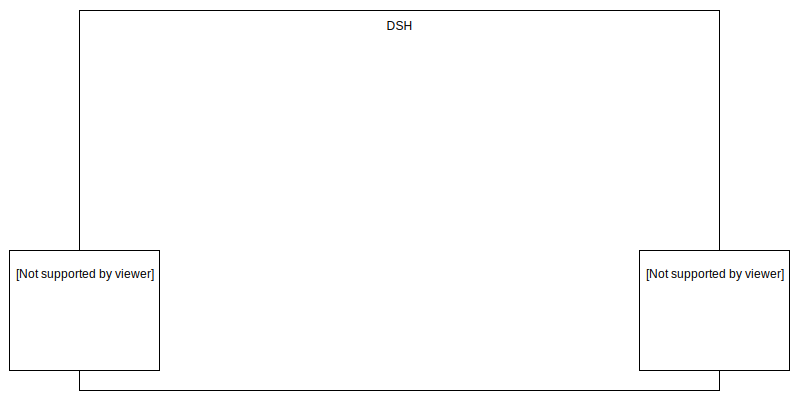
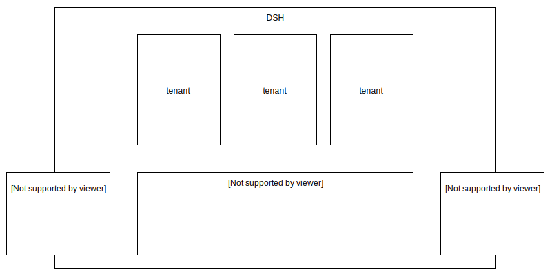
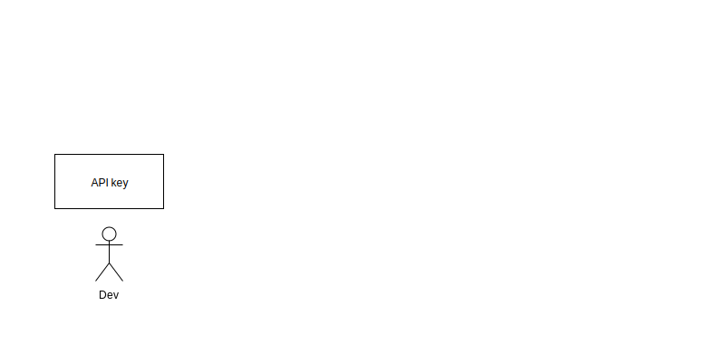
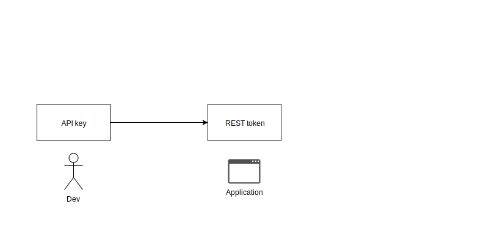
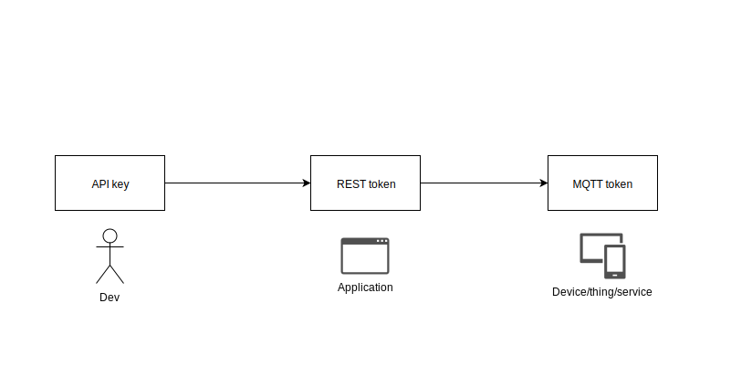
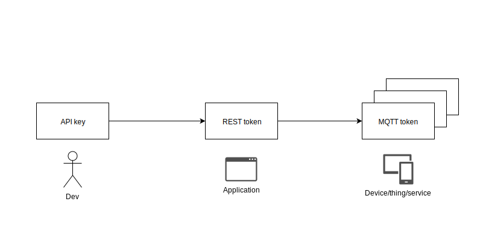

<!-- .slide: data-background="./images/kpn-intro-bg-md.jpg" -->
# An introduction to the Data Services Hub

<!--s-->
# What is the DSH?
<!-- .slide: class="nobullets" -->
- Streaming Data Platform <!-- .element: class="fragment" data-fragment-index="1" -->
- Stream Processing Platform <!-- .element: class="fragment" data-fragment-index="2" -->
- Data Stream Platform <!-- .element: class="fragment" data-fragment-index="3" -->

<!--s-->
# Platform 

- A (software) platform is anything you can build (applications) on
- Provides reusable infrastructure
- Takes care of recurring and tedious tasks
- Should not hamper creativity

<!--s-->
# Streaming Data Platform 

A platform that does something with <!-- .element: class="fragment" data-fragment-index="1" --> _streaming data_ <!-- .element: class="fragment" data-fragment-index="1" -->

<!--v-->
## Streaming Data

> &hellip;data that is generated continuously by thousands of data
> sources, which typically send in the data records simultaneously, and in
> small sizes (order of Kilobytes). 

https://aws.amazon.com/streaming-data

<!--v-->
## And out?

> A streaming data platform should also be able to continuously send selected
> data records to thousands of data syncs.

&ndash;according to us

<!--s-->
# Types of streaming data

Not all datastreams are created equal
 <!-- .element: class="thinner fragment" data-fragment-index="1" -->
 <!-- .element: class="thinner fragment" data-fragment-index="1" -->

<!--v-->
## Streaming data on DSH 

Focus on two types of streams:
- MQTT
- Kafka

<!--v-->
## MQTT

- Lightweight messaging protocol
- Suitable for many simultaneous connections
- Widespread use in *Internet of Things*

<!--v-->
## Kafka

- Highly scalable in volume of data
- Messaging backbone for LinkedIn

<!--v-->
## Kafka vs MQTT

- MQTT
  - _must_ be low volume (max 10 msgs/sec)
  - can have many sources/sinks
  - sources/sinks can reside outside of DSH
- Kafka
  - can have high volume (millions of msgs/sec)
  - _must_ have few sources/sinks
  - sources/sinks _must_ reside inside DSH

$$ \text{MQTT} \cdot \frac{sources}{sinks} \approx \text{Kafka} \cdot \frac{sources}{sinks} $$ <!-- .element: class="fragment" data-fragment-index="1" -->

<!--s-->
<!-- .slide: data-transition="fade" -->
## Overview

<!-- .element: class="plain" -->

<!--v-->
<!-- .slide: data-transition="fade" -->
## Overview

<!-- .element: class="plain" -->

<!--v-->
<!-- .slide: data-transition="fade" -->
## Overview

<!-- .element: class="plain" -->

<!--v-->
<!-- .slide: data-transition="fade" -->
## Overview

<!-- .element: class="plain" -->

<!--s-->
# Bridge

- MQTT allows wildcard subscriptions: `/tt/topic/some/prefix/#`
- Which latest value store instance?
- All wildcards must map to 1 instance <!-- .element: class="fragment" data-fragment-index="1" -->
- No wildcards below a certain topic depth  <!-- .element: class="fragment" data-fragment-index="1" -->

<!--v-->
## Rarely updated data sources

- Latest value store indexing service
- tracks keys in a stream
- distributed in-memory key-value store
- currently: retrieved on MQTT subscription

<!--v-->
## Bridge

$$
\begin{align}
\text{MQTT topic prefix} &= \text{Kafka cluster name} \\\\\\  
\text{MQTT topic infix}  &= \text{Kafka topic name} \\\\\\
\text{keys in Kafka}     &= \text{MQTT topic suffix} \\\\\\ 
\end{align}
$$

```scala
MQTT(topic="/tt/cam/id", data="...")
```
<!-- .element: class="fragment" data-fragment-index="2" -->
$=$
<!-- .element: class="fragment" data-fragment-index="2" -->
```scala
Kafka(cluster="tt", topic="stream.cam.*", key="id", data="...")
```
<!-- .element: class="fragment" data-fragment-index="2" -->

<!--s-->
<!-- .slide: data-transition="fade" -->
## Overview

<!-- .element: class="plain" -->

<!--v-->
<!-- .slide: data-transition="fade" -->
## Overview

<!-- .element: class="plain" -->

<!--s-->
# Wrap up

- MQTT for low volume, many sources/sinks
- Kafka for high volume, few sources/sinks
- bridge (protocol adaptor) to tie them together 
- custom data source adapters for external data 
- latest value store for quicker syncing with the data source

<!--s-->
## External data sources 

- most will not be adapted to stream to DSH
- most don't even stream
- need ways to pull in that data (and make it streaming)

<!--s-->
# Stream Processing Platform
=  <!-- .element: class="fragment" data-fragment-index="1" -->
## A platform that does  <!-- .element: class="fragment" data-fragment-index="1" --> _stream processing_  <!-- .element: class="fragment" data-fragment-index="1" -->

<!--s-->
## Stream Processing

> &hellip; is the processing of data in motion, or in other words,
> computing on data directly as it is produced or received.

https://data-artisans.com/what-is-stream-processing

<!--s-->
<!-- .element: class="thin" -->

<!--s-->
## Where to process

Where it makes sense

- At the edge where possible (selective)
- Close to the data (on the platform) if you need a lot of data

<!--s-->
## Many ways to process the data

- Many frameworks for stream processing
- No framework fits all use-cases
- DSH does not dictate a framework

No _One framework to rule them all_, but the DSH to _bind them_.

<!--s-->
# Security nightmare

- Need to allow other people on your platform for proximity
- And they can use whatever software they want on the platform

<!--s-->
## DC/OS

- Started with DC/OS as base platform 
- Supported by most stream processing frameworks
- Tenants run docker containers on top

<!--s-->
## Securing

- Custom container manager to force correct use of Docker
- Custom resource manager to control resource requests
- Calico for network isolation

<!--s-->
# Wrap up

- DC/OS
- Docker + extra restrictions
- Tenant networks

<!--s-->
# Data Stream Platform

a platform that holds many different _data streams_

<!--v-->
## Data Stream

A sequence of digitally encoded signals used to represent information in transmission.

[Federal Standard 1037C](https://www.its.bldrdoc.gov/fs-1037/fs-1037c.htm)

<!--v-->
## Many data streams

- Need some organization for all these streams
- DSH topics $ \approx $ Kafka topics
- Need to control access to topics <!-- .element: class="fragment" data-fragment-index="2" -->
	- Manage at topic level using custom tooling <!-- .element: class="fragment" data-fragment-index="1" -->

<!--v-->
## Authenticate

- Certificates for tenant (container) authentication towards Kafka
- API keys to authenticate tenants that want to let devices/things/users connect to the platform
- Tokens for MQTT authentication of devices/things and users
- REST token for authentication of MQTT token requests

<!--v-->
<!-- .slide: data-transition="fade" -->
## Authentication relations

<!-- .element: class="plain" -->

<!--v-->
<!-- .slide: data-transition="fade" -->
## Authentication relations

<!-- .element: class="plain" -->

<!--v-->
<!-- .slide: data-transition="fade" -->
## Authentication relations

<!-- .element: class="plain" -->

<!--v-->
<!-- .slide: data-transition="fade" -->
## Authentication relations

<!-- .element: class="plain" -->

<!--v-->
## Device management

- DSH does not manage devices
- Up to the tenant 
- But: (ac)counting (device/thing ids)

<!--v-->
## Access control

- Fine-grained on MQTT
  - read `/tt/topic/fixed/tenant/+/#`
  - write `/tt/topic/other/tenant/+`
- Coarse-grained on Kafka
  - read/write on topic-level

<!--v-->
## Kafka: Some implicit rules

-  _stream._ topic
-  _internal._ topic 
-  _scratch._ topic

<!--v-->
## Data lineage

- On mqtt: add info about producer to the message (envelopes)
- On kafka? 
- Offers no way to enforce this   <!-- .element: class="fragment" data-fragment-index="1" -->

<!--v-->
## Kafka lineage 
-  stream.topic   _.tenant_  <!-- .element: class="fragment" data-fragment-index="1" --> 
-  internal.topic   _.tenant_ <!-- .element: class="fragment" data-fragment-index="1" -->
-  scratch.topic   _.tenant_ <!-- .element: class="fragment" data-fragment-index="1" -->

<!--s-->
# Wrap up

- API keys, REST token & MQTT tokens 
- Kafka certificates
- ACLs on all streams/topics
- Kafka topics scheme

<!--s-->
<!-- .slide: data-background="./images/kpn-end-bg-md.jpg" -->
