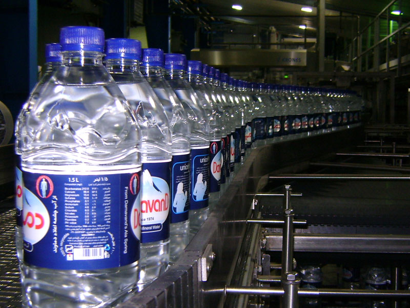

<!-- .slide: data-background="./images/kpn-intro-bg-md.jpg" -->
## An introduction to<br>the Data Services Hub

<!--s-->
## What is the DSH?
<br>
### Streaming Data Platform <!-- .element: class="fragment" data-fragment-index="1" -->
<br>
### Stream Processing Platform <!-- .element: class="fragment" data-fragment-index="2" -->
<br>
### Data Stream Platform <!-- .element: class="fragment" data-fragment-index="3" -->

<!--s-->
### Platform 

- A (software) platform is basically anything you can build (applications) on
- Provides reusable infrastructure <!-- .element: class="fragment" data-fragment-index="1" -->
- Takes care of recurring and tedious tasks <!-- .element: class="fragment" data-fragment-index="1" -->
- Not hamper creativity <!-- .element: class="fragment" data-fragment-index="2" -->

<!--s-->
### Streaming Data Platform 
= <!-- .element: class="fragment" data-fragment-index="1" -->
### A platform that does something with <!-- .element: class="fragment" data-fragment-index="1" --> _streaming data_ <!-- .element: class="fragment" data-fragment-index="1" -->

<!--s-->
## Streaming Data?

> ...data that is generated continuously by thousands of data
> sources, which typically send in the data records simultaneously, and in
> small sizes (order of Kilobytes). 

https://aws.amazon.com/streaming-data

<!--s-->
## And out?

> A streaming data platform should also be able to continuously sent selected
> data records to thousands of data syncs.

<!--s-->
### Different types of streaming data

 <!-- .element: class="thinner fragment" data-fragment-index="1" -->
 <!-- .element: class="thinner fragment" data-fragment-index="1" -->

<!--s-->
### streaming data on DSH 

- MQTT
  - _must_ be low volume (max 10 msgs/sec)
  - can have many sources/sinks
  - sources/sinks can reside outside of DSH
- Kafka
  - sources/sinks _must_ reside inside DSH
  - _must_ have few sources/sinks
  - can have high volume (millions of msgs/sec)

MQTT \* sources/sinks =~ Kafka * sources/sinks <!-- .element: class="fragment" data-fragment-index="1" -->

<!--s-->
### bridge

- MQTT topic prefix = Kafka cluster name <!-- .element: class="fragment" data-fragment-index="1" -->
- MQTT topic infix = Kafka topic name  <!-- .element: class="fragment" data-fragment-index="1" -->
- keys in Kafka = MQTT topic suffix  <!-- .element: class="fragment" data-fragment-index="1" -->

```scala
MQTT(topic="/tt/cam/id", data="...")

equals

Kafka(cluster="tt", topic="stream.cam.*", key="id", data="...")
```
<!-- .element: class="fragment" data-fragment-index="2" -->

<!--s-->
 

<!--s-->
### Rarely updated data sources

- Latest value store indexing service
- tracks keys in a stream
- distributed in-memory key-value store
- currently: retrieved on MQTT subscription

<!--s-->
### Bridge (bis)

- MQTT allows wildcard subscriptions: `/tt/topic/some/prefix/#`
- Which latest value store instance?
- All wildcards must map to 1 instance <!-- .element: class="fragment" data-fragment-index="1" -->
- No wildcards below a certain topic depth  <!-- .element: class="fragment" data-fragment-index="1" -->

<!--s-->


<!--s-->
### External data sources 

- most will not be adapted to stream to DSH
- most don't even stream
- need ways to pull in that data (and make it streaming)

<!--s-->
## Wrap up

- MQTT for low volume, many sources/sinks
- Kafka for high volume, few sources/sinks
- bridge (protocol adaptor) to tie them together 
- custom data source adapters for external data 
- latest value store for quicker syncing with the data source

<!--s-->
### Stream Processing Platform
=  <!-- .element: class="fragment" data-fragment-index="1" -->
### A platform that does  <!-- .element: class="fragment" data-fragment-index="1" --> _stream processing_  <!-- .element: class="fragment" data-fragment-index="1" -->

<!--s-->
## Stream Processing?

> ... is the processing of data in motion, or in other words,
> computing on data directly as it is produced or received.

https://data-artisans.com/what-is-stream-processing

<!--s-->
<!-- .element: class="thin" -->

<!--s-->
## Where to process?

Where it makes sense =

- At the edge where possible (selective)
- Close to the data (on the platform) if you need a lot of data

<!--s-->
## Many ways to process the data

- Many frameworks for stream processing
- No framework fits all use-cases
- DSH does not dictate a framework


<!--s-->
## Security nightmare

- Need to allow other people on your platform for proximity
- And they can use whatever software they want on the platform


<!--s-->
## DC/OS

- Started with DC/OS as base platform 
- Supported by most stream processing frameworks
- Tenants run docker containers on top

<!--s-->
## Securing

- Custom container manager to force correct use of docker
- Custom resource manager to control resource requests
- Calico for network isolation

<!--s-->
## Wrap up

- DC/OS
- Docker + extra restrictions
- Tenant networks

<!--s-->
###  Data Stream Platform

= <!-- .element: class="fragment" data-fragment-index="1" -->
### a platform that holds many different <!-- .element: class="fragment" data-fragment-index="1" --> _data streams_ <!-- .element: class="fragment" data-fragment-index="1" -->

<!--s-->
### Data Stream?

A sequence of digitally encoded signals used to represent information in transmission.

[Federal Standard 1037C](https://www.its.bldrdoc.gov/fs-1037/fs-1037c.htm)

<!--s-->
### Many data streams

- Need some organization for all these streams
- We organize in topics that ~ Kafka topics
- Manage @ topic level with custom tools <!-- .element: class="fragment" data-fragment-index="1" -->
- Need to control access to topics <!-- .element: class="fragment" data-fragment-index="2" -->

<!--s-->
### Authenticate

- Certificates for tenant (container) authentication towards Kafka
- Api-Keys to authenticate tenants that want to let devices/things/users connect to the platform
- Tokens for MQTT authentication of devices/things and users

<!--s-->
### Device management

- Do not have it
- Currently: Left to the tenant 
- But: (ac)counting (device/thing ids)

<!--s-->
### Access control

- Fine grained on MQTT
  - read `/tt/topic/fixed/tenant/+/#`
  - write `/tt/topic/other/tenant/+`
- Coarse grained on Kafka: can you read/write a topic

<!--s-->
### Kafka: Some implicit rules

-  _stream._ topic
-  _internal._ topic 
-  _scratch._ topic

<!--s-->
### Data lineage

- On mqtt: add info about producer to the message (envelopes)
- On kafka? 
- Offers no way to enforce this   <!-- .element: class="fragment" data-fragment-index="1" -->

<!--s-->
### Kafka lineage 
-  stream.topic   _.tenant_  <!-- .element: class="fragment" data-fragment-index="1" --> 
-  internal.topic   _.tenant_ <!-- .element: class="fragment" data-fragment-index="1" -->
-  scratch.topic   _.tenant_ <!-- .element: class="fragment" data-fragment-index="1" -->

<!--s-->
## Wrap up

- MQTT api keys & tokens 
- Kafka certificates
- Acls on all streams/topics
- Kafka topics scheme

<!--s-->
<!-- .slide: data-background="./images/kpn-end-bg-md.jpg" -->
## From here
