<!-- .initialize({
	width: "100%",
	height: "100%",
	margin: 0,
	minScale: 0.2,
	maxScale: 3
});-->

<!-- .slide: data-background="./images/kpn-intro-bg-md.jpg" -->

## An introduction to the Data Services Hub

<!--s-->
### What is the DSH?

The DSH is a <!-- .element: class="fragment" data-fragment-index="1" -->

Streaming Data <!-- .element: class="fragment" data-fragment-index="2" -->

Platform <!-- .element: class="fragment" data-fragment-index="3" -->

<!--v-->
## Definition: platform

- According to us, a platform ...
  - is something you can build (applications) on <!-- .element: class="fragment"-->
  - provides reusable infrastructure <!-- .element: class="fragment"-->
  - takes care of recurring and tedious tasks <!-- .element: class="fragment"-->
  - should not hamper creativity <!-- .element: class="fragment"-->

<!--v-->
## What is the DSH again?

Streaming Data Platform <!-- .element: class="fragment"-->

<!--v-->
## Definition: streaming data

> &hellip; data that is generated continuously by many independent data
> sources. Typically, this data is of small size (order of Kilobytes).

- Data <!-- .element: class="fragment"--> is _streaming_ if it is produced and transmitted __without delays or batching__
- The <!-- .element: class="fragment"--> smallest unit of streamed data is called a _message_ or _event_ 
- Streaming <!-- .element: class="fragment"--> data is sorted, collected, or aggregated in a _stream_ or _topic_

Note: the underlying technologies use the term 'topic' in different ways, so we will denote it as a _stream_, primarily

<!--v-->
### Types of streaming data

Not all datastreams are created equal

 <!-- .element: class="thinner fragment" data-fragment-index="1" -->
 <!-- .element: class="thinner fragment" data-fragment-index="1" -->

<!--s-->
## What should a streaming data platform be able to do?

- 
  - handle hundreds of thousands of sources <!-- .element: class="fragment"-->
  - send data to hundreds of thousands of sinks <!-- .element: class="fragment"-->
  - process (clean, refine, aggregate, combine) data <!-- .element: class="fragment"-->
  - share data streams with other parties <!-- .element: class="fragment"-->
  - do <!-- .element: class="fragment" --> all of this, with _high security standards_

<!--v-->
### Key concepts:

- 
  - Scalable <!-- .element: class="fragment"-->
  - Data as low-latency events (streams) <!-- .element: class="fragment"-->
  - Real-time processing <!-- .element: class="fragment"-->
  - Data sharing <!-- .element: class="fragment"-->
  - Secure <!-- .element: class="fragment"-->

Note: remember these key concepts!

<!--v-->
### Types of streaming data, for the DSH

 <!-- .element: class="thinner fragment" data-fragment-index="1" -->
 <!-- .element: class="thinner fragment" data-fragment-index="1" -->

$$
\begin{align}
\text{many sources, low volume} &| \text{few sources, high volume} \\\\\\  
\text{Single sensor} &| \text{Stream processing} \\\\\\  
\text{MQTT} &| \text{Kafka} \\\\\\  
\end{align}
$$ <!-- .element: class="fragment" data-fragment-index="2" -->

Note: MQTT and Kafka are equally useful, but for very different reasons

<!--s-->
## Visual representation of the DSH

<!--v-->
<!-- .slide: data-transition="fade" -->
<!-- .element: class="stretch" style="background:none; border:none; box-shadow:none;" width="100%" -->

<!--v-->
<!-- .slide: data-transition="fade" -->
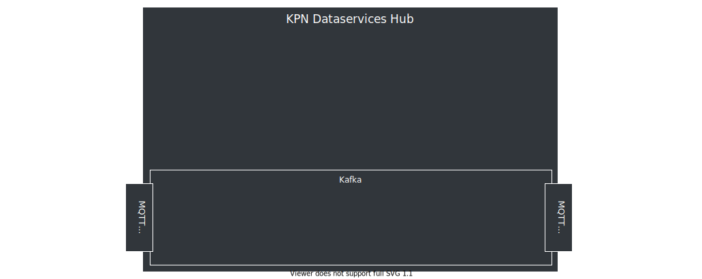<!-- .element: class="stretch" style="background:none; border:none; box-shadow:none;" width="100%" -->

Note: the core of the DSH messaging is a Kafka bus. Note the MQTT bridge.

<!--s-->
## Kafka

Do we know what Kafka is?

<!--v-->
## Kafka is ...

- 
  - Can <!-- .element: class="fragment"--> handle _huge_ volumes of data
  - Event-based <!-- .element: class="fragment"-->
  - Allows subscribe and publish <!-- .element: class="fragment"-->
  - Used by:  <!-- .element: class="fragment"-->
    - LinkedIn
    - Netflix
    - Twitter
    - PayPal

Note: other examples:
- British Gas
- Goldman Sachs
- Cisco Systems
- Spotify
- Salesforce
- Uber
- Yelp
- Pinterest
- eBay
- Cloudflare

<!--s-->
## MQTT

Do we know what MQTT is?

<!--v-->
## MQTT is ...
- 
  - Messaging protocol based around publish and subscribe<!-- .element: class="fragment" data-fragment-index="1"-->
  - Lightweight<!-- .element: class="fragment" data-fragment-index="2"-->
  - Widespread use in the <!-- .element: class="fragment" data-fragment-index="3" --> *Internet of Things (IoT)* <!-- .element: class="fragment" data-fragment-index="4" -->
  - Suitable for many simultaneous connections <!-- .element: class="fragment" data-fragment-index="5" -->
  - ISO/IEC 20922 and OASIS standard <!-- .element: class="fragment" data-fragment-index="6" -->
  - Fine-grained access control<!-- .element: class="fragment" -->

Note: MQTT is a very good way to get data on the DSH.
- Sensor on a bridge, which sleeps unless the bridge state (open/closed) changes
- Door contact, which sends a message when the door opens
- Temperaturesensor in a refrigirated shipping container
- Active heartmonitor, which sends messages on `events` (think irregular heartrate)
- GPS on a smartphone (owntracks, Casper's phone)
- Security camera, which sends the picture of the intruder

<!--v-->
### Do I have to use MQTT?

- 
  - Maybe you don't need the features MQTT brings? <!-- .element: class="fragment" -->
  - Maybe MQTT is hard to implement in your case?  <!-- .element: class="fragment" -->
  - Maybe another protocol is already implemented?  <!-- .element: class="fragment" -->

We allow tenants to write custom protocol adapters  <!-- .element: class="fragment" -->

Note: we do not say other adapters are in the works. Kafka is the backbone, MQTT is one very cool way of ingesting/extruding data

<!--s-->
### MQTT vs Kafka

- MQTT
  - usually low volume _(default 10 msgs/sec)_
  - can have many sources/sinks (millions)
  - sources/sinks can reside outside of DSH
- Kafka
  - can have high volume (millions of msgs/sec)
  - performs best with few sources/sinks
  - sources/sinks reside _inside_ DSH

<!-- $$ \text{MQTT} \cdot \frac{sources}{sinks} \approx \text{Kafka} \cdot \frac{sources}{sinks} $$ .element: class="fragment" data-fragment-index="1" -->

Note:
- kafka sources/sinks can also reside outside of DSH
- more technical details will follow

<!--v-->
### Access control

- Fine-grained on MQTT
  - Access Control Lists (ACLs)
  - read `/tt/topic/fixed/tenant/+/#`
  - write `/tt/topic/other/tenant/`
- Coarse-grained on Kafka
  - read/write on topic-level
  - implemented using custom tooling

<!--s-->
<!-- .slide: data-transition="fade" -->
<!-- .element: class="stretch" style="background:none; border:none; box-shadow:none;" width="100%" -->

Note: the core of the DSH messaging is a Kafka bus. Note the MQTT bridge.

<!--v-->
<!-- .slide: data-transition="fade" -->
<!-- .element: class="stretch" style="background:none; border:none; box-shadow:none;" width="100%" -->
Note: we connect sources and sinks through MQTT bridges. The messages they send, end up on a 'stream'.

<!--v-->
<!-- .slide: data-transition="fade" -->
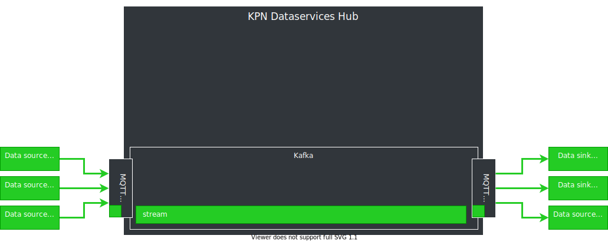<!-- .element: class="stretch" style="background:none; border:none; box-shadow:none;" width="100%" -->
Note: we connect sources and sinks through MQTT bridges. The messages they send, end up on a 'stream'.

<!--v-->
<!-- .slide: data-transition="fade" -->
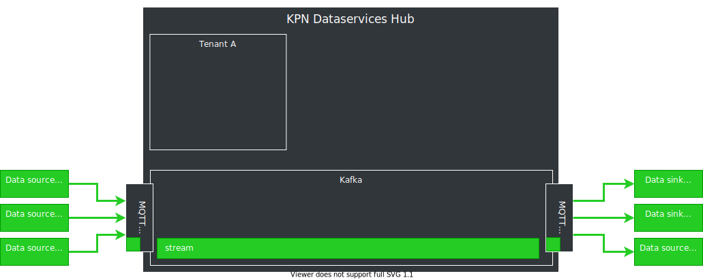<!-- .element: class="stretch" style="background:none; border:none; box-shadow:none;" width="100%" -->
Note: tenant A, which also belongs to party A

<!--v-->
<!-- .slide: data-transition="fade" -->
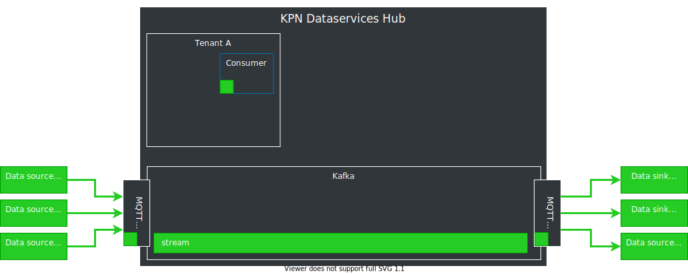<!-- .element: class="stretch" style="background:none; border:none; box-shadow:none;" width="100%" -->
Note: within tenant A, party A can run its services

<!--v-->
<!-- .slide: data-transition="fade" -->
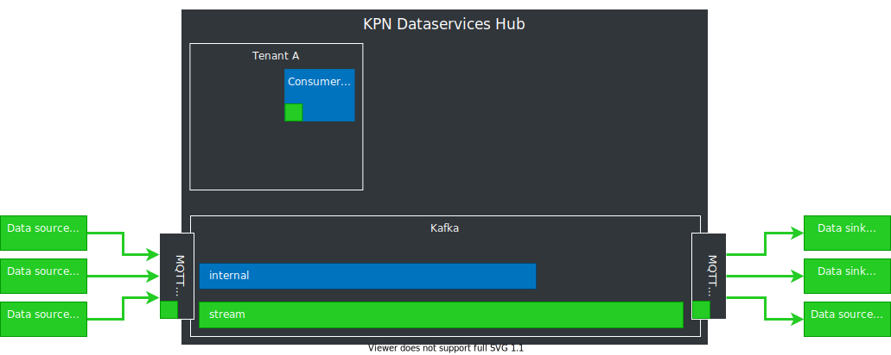<!-- .element: class="stretch" style="background:none; border:none; box-shadow:none;" width="100%" -->
Note: within tenant A, party A can also make use of Kafka

<!--v-->
<!-- .slide: data-transition="fade" -->
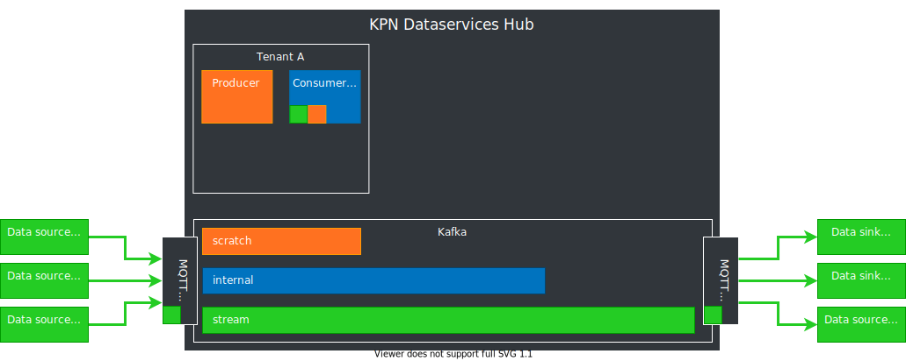<!-- .element: class="stretch" style="background:none; border:none; box-shadow:none;" width="100%" -->
Note: this is tenant B, belonging to party B

<!--v-->
<!-- .slide: data-transition="fade" -->
<!-- .element: class="stretch" style="background:none; border:none; box-shadow:none;" width="100%" -->
Note: and here we have tenant C, belonging to party C

<!--v-->
<!-- .slide: data-transition="fade" -->
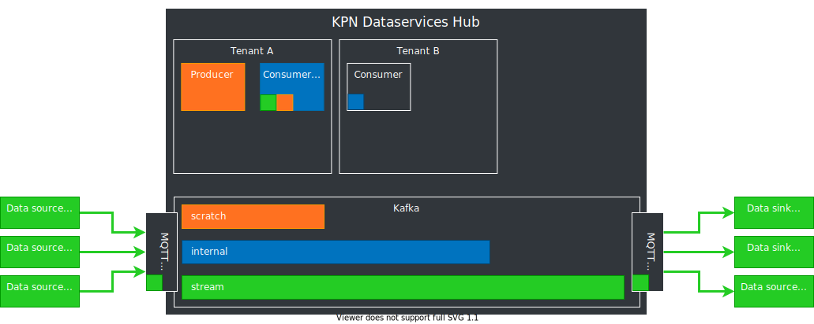<!-- .element: class="stretch" style="background:none; border:none; box-shadow:none;" width="100%" -->

<!--v-->
<!-- .slide: data-transition="fade" -->
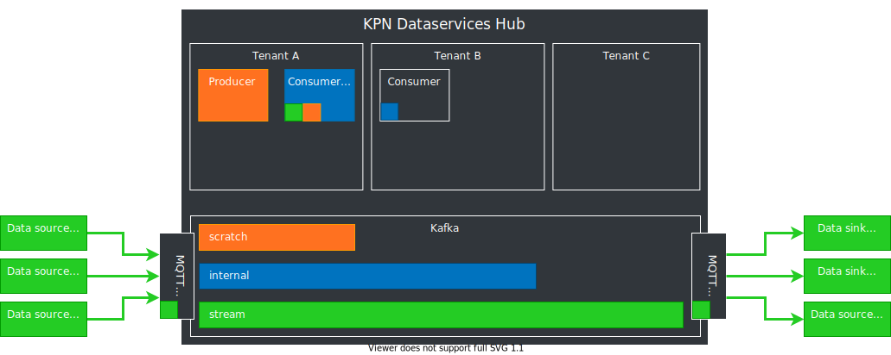<!-- .element: class="stretch" style="background:none; border:none; box-shadow:none;" width="100%" -->

<!--v-->
<!-- .slide: data-transition="fade" -->
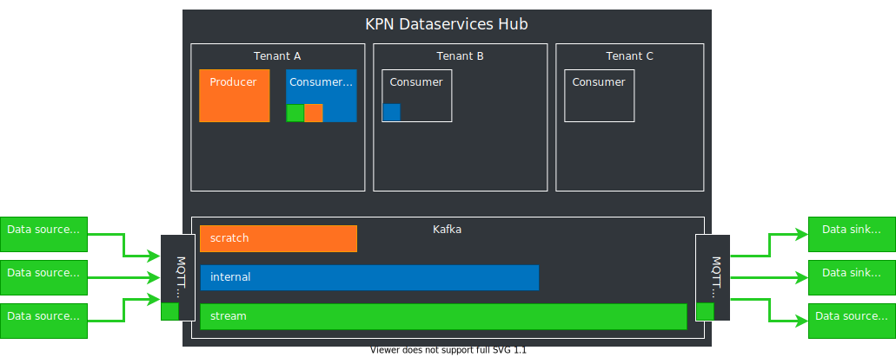<!-- .element: class="stretch" style="background:none; border:none; box-shadow:none;" width="100%" -->
Note: if party A wants to share data with B, it can. Data is not shared by default, and even MQTT access is on an explicit opt-in basis. If not specified, tenant C cannot access, or even see, this stream

<!--s-->
## Stream Processing

> &hellip; is the processing of data in motion, or in other words,
> computing on data directly as it is produced or received.

https://data-artisans.com/what-is-stream-processing

<!--v-->
### Where to process
<!-- .element: class="stretch" style="background:none; border:none; box-shadow:none;" width="100%" -->

Note: ECG sensors. First, all data is processed at the computer of the doctor, so all data needs to be transferred and stored. All data is relevant, since all data is needed for processing. Migrating processing to the device allows for less data in need to be transferred: less power usage, less storage required, and faster decision making. The DSH allows for an intermediate step, where the load is not placed on the source or the sink.

<!--v-->
### Many ways to process the data

- Many frameworks for (stream) processing
- No framework fits all use-cases
- DSH does not dictate a framework

No _One framework to rule them all_, but the DSH to _bind them_.  

Note: analogy: if you have a BMW, you'll to bring it to a garage that is familiar with BMW. However, we provide an empty shed, you bring your own tools. We don't care if you're going to come in with a BMW, Audi, or a horse.

<!--s-->
## Security nightmare

- You share the platform with others <!-- .element: class="fragment"-->
- People can use whatever they want <!-- .element: class="fragment"-->

<!--v-->
<!-- .slide: data-transition="fade" -->
### Base DSH
<!-- .element: class="stretch" style="background:none; border:none; box-shadow:none;" width="100%" -->

- 
  - Containers <!-- .element: class="fragment"--> (_Docker_)
  - Force <!-- .element: class="fragment"--> proper Docker usage (no __root__)

<!--v-->
<!-- .slide: data-transition="fade" -->
### Calico
<!-- .element: class="stretch" style="background:none; border:none; box-shadow:none;" width="100%" -->

- 
  - Network <!-- .element: class="fragment"--> isolation through __Calico__
  - Container <!-- .element: class="fragment"--> authentication towards Kafka through _certificates_

Note: This is also enforced by User IDs (UIDs)

<!--s-->
### MQTT authentication relations

<!--v-->
<!-- .slide: data-transition="fade" -->

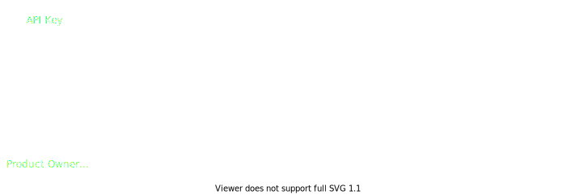<!-- .element: class="stretch" style="background:none; border:none; box-shadow:none;" width="100%" -->

Note: API Key is to authenticate tenants
<!--v-->
<!-- .slide: data-transition="fade" -->

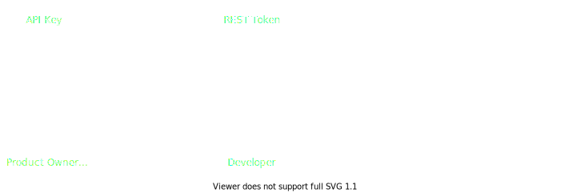<!-- .element: class="stretch" style="background:none; border:none; box-shadow:none;" width="100%" -->

Note: REST token is to hand out permissions to individuals
Do be aware REST-tokens also 

<!--v-->
<!-- .slide: data-transition="fade" -->

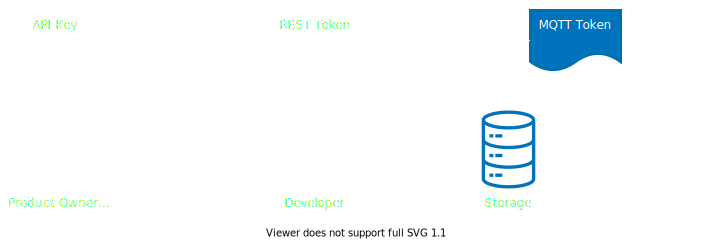<!-- .element: class="stretch" style="background:none; border:none; box-shadow:none;" width="100%" -->

Note: MQTT tokens are to give devices and applications claims and permissions

<!--v-->
<!-- .slide: data-transition="fade" -->

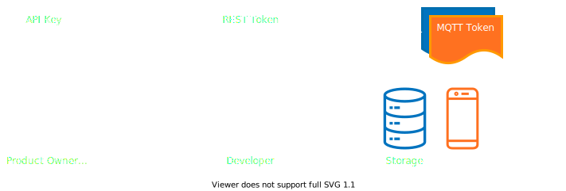<!-- .element: class="stretch" style="background:none; border:none; box-shadow:none;" width="100%" -->

<!--v-->
<!-- .slide: data-transition="fade" -->

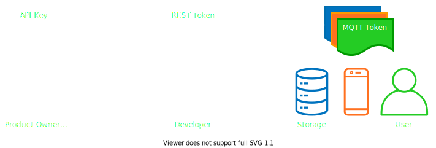<!-- .element: class="stretch" style="background:none; border:none; box-shadow:none;" width="100%" -->

<!--v-->
### Device management

- DSH<!-- .element: class="fragment" -->  _does not_ manage devices
  - You are free to implement whatever you need <!-- .element: class="fragment" -->
  - The DSH does provide some of the necessary building blocks (MQTT tokens) <!-- .element: class="fragment" -->

<!--s-->
<!-- .slide: data-background="./images/kpn-end-bg-md.jpg" -->
## Practical part; MQTT
[MQTT](localhost:1948/mqtt.md)

[Deployment](localhost:1948/deploying.md)

[Console](http://console.poc.kpn-dsh.com)
