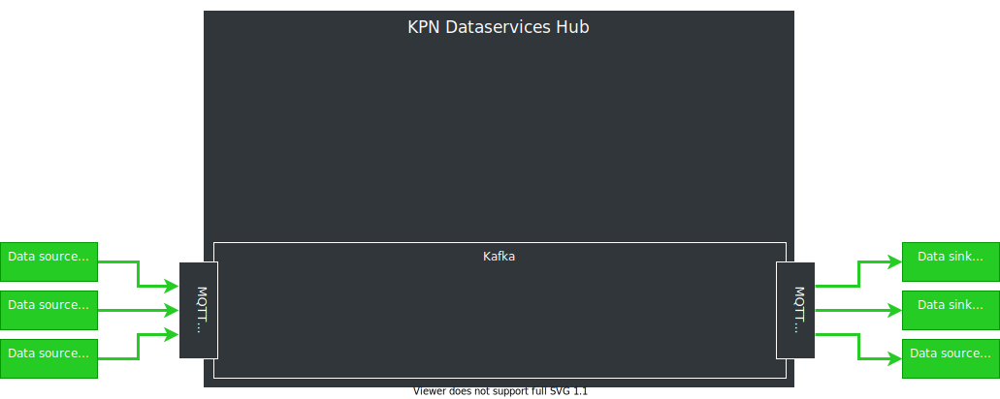

<!-- .initialize({
	width: "100%",
	height: "100%",
	margin: 0,
	minScale: 0.2,
	maxScale: 3
});-->

<!-- .slide: data-background="./images/kpn-intro-bg-md.jpg" -->

## An introduction to the Data Services Hub

<!--s-->
### What is the DSH?

The DSH is an <!-- .element: class="fragment" data-fragment-index="1" -->

AWESOME <!-- .element: class="fragment" data-fragment-index="2" -->

Streaming Data Platform <!-- .element: class="fragment" data-fragment-index="3" -->

Note: information dump starts in the next slide. We'll start on generic features and advantages, and spiral down to the fun details.
<!--v-->

### Definition: platform

- A (software) platform is something you can build (applications) on <!-- .element: class="fragment"-->
- Provides reusable infrastructure <!-- .element: class="fragment"-->
- Takes care of recurring and tedious tasks <!-- .element: class="fragment"-->
- Should not hamper creativity <!-- .element: class="fragment"-->

Note: we've established we have a platform, now we're going to talk about its properties

<!--v-->
### Why is the DSH awesome?

Key concepts:

- Data as low-latency events (streams) <!-- .element: class="fragment"-->
- Real-time processing <!-- .element: class="fragment"-->
- Data sharing <!-- .element: class="fragment"-->
- Scalable platform <!-- .element: class="fragment"-->
- Secure <!-- .element: class="fragment"-->

What does the DSH do better than others?  <!-- .element: class="fragment"-->

Everything on this list, and more! <!-- .element: class="fragment"-->

Note: "We'll explain these concepts further, it should become clear why you should pick the DSH." Make audience remember 'streams,processing,sharing,scalable,secure'.

<!--s-->

## Definition: Streaming Data

> &hellip;data that is generated continuously by thousands of data
> sources, which typically send in the data records simultaneously, and in
> small sizes (order of Kilobytes).

[https://aws.amazon.com/streaming-data](https://aws.amazon.com/streaming-data)

A streaming platform should be able to handle thousands of data sources  <!-- .element: class="fragment"-->

Note: this is a quote, and as such only applies to the view of the person making the quote

<!--v-->

### We expect more

A streaming data platform should be able to:

- handle hundreds of thousands of sources <!-- .element: class="fragment"-->
- send data to hundreds of thousands of sinks <!-- .element: class="fragment"-->
- process (clean, refine, aggregate, combine) data <!-- .element: class="fragment"-->
- share data streams with other parties <!-- .element: class="fragment"-->
- do all of this, with <!-- .element: class="fragment" --> __high security standards__ <!-- .element: class="fragment" data-fragment-index="6"-->

Note: security is a big part of the DSH, and can be perceived as annoying, at first

<!--v-->
### Data Streams
<!-- .slide: data-transition="fade" -->
> A sequence of digitally encoded signals, used to represent information in transmission.

[Federal Standard 1037C](https://www.its.bldrdoc.gov/fs-1037/fs-1037c.htm)

<!--v-->
### Types of streaming data

Not all datastreams are created equal

 <!-- .element: class="thinner fragment" data-fragment-index="1" -->
 <!-- .element: class="thinner fragment" data-fragment-index="1" -->

$$
\begin{align}
\text{many sources, low volume} &| \text{few sources, high volume} \\\\\\  
\text{Single sensor} &| \text{Stream processing} \\\\\\  
\text{MQTT} &| \text{Kafka} \\\\\\  
\end{align}
$$ <!-- .element: class="fragment" data-fragment-index="2" -->

Note: MQTT and Kafka are equally useful, but for very different reasons

<!--s-->
## MQTT
- Messaging protocol based around publish and subscribe<!-- .element: class="fragment" data-fragment-index="1"-->
- Lightweight<!-- .element: class="fragment" data-fragment-index="2"-->
- Widespread use in the <!-- .element: class="fragment" data-fragment-index="3" --> *Internet of Things (IoT)* <!-- .element: class="fragment" data-fragment-index="4" -->
- Suitable for many simultaneous connections <!-- .element: class="fragment" data-fragment-index="5" -->
- ISO/IEC 20922 and OASIS standard <!-- .element: class="fragment" data-fragment-index="6" -->
- Fine-grained access control<!-- .element: class="fragment" -->

Note: MQTT is a very good way to get data on the DSH.
- Sensor on a bridge, which sleeps unless the bridge state (open/closed) changes
- Door contact, which sends a message when the door opens
- Temperaturesensor in a refrigirated shipping container
- Active heartmonitor, which sends messages on `events` (think irregular heartrate)
- GPS on a smartphone (owntracks, Casper's phone)
- Security camera, which sends the picture of the intruder

<!--v-->
### Do I have to use MQTT?

- Maybe you don't need the features MQTT brings? <!-- .element: class="fragment" -->
- Maybe MQTT is hard to implement in your case?  <!-- .element: class="fragment" -->
- Maybe another protocol is already implemented?  <!-- .element: class="fragment" -->

We allow tenants to write custom protocol adapters  <!-- .element: class="fragment" -->

Note: we do not say other adapters are in the works. Kafka is the backbone, MQTT is one very cool way of ingesting/extruding data

<!--v-->
### Kafka

- Can handle _huge_ volumes of data
- Event-based <!-- .element: class="fragment"-->
- Allows subscribe and publish <!-- .element: class="fragment"-->
- Used by:  <!-- .element: class="fragment"-->
    - LinkedIn
    - Netflix
    - Twitter
    - PayPal

Note: other examples:
- British Gas
- Goldman Sachs
- Cisco Systems
- Spotify
- Salesforce
- Uber
- Yelp
- Pinterest
- eBay
- Cloudflare

<!--v-->
### MQTT vs Kafka

- MQTT
  - _usually_ low volume _(default 10 msgs/sec)_
  - can have many sources/sinks (millions)
  - sources/sinks can reside outside of DSH
- Kafka
  - can have high volume (millions of msgs/sec)
  - _must_ have few sources/sinks
  - sources/sinks reside inside DSH

<!-- $$ \text{MQTT} \cdot \frac{sources}{sinks} \approx \text{Kafka} \cdot \frac{sources}{sinks} $$ .element: class="fragment" data-fragment-index="1" -->

Note:
- kafka sources/sinks can also reside outside of DSH
- more technical details will follow

<!--s-->
## Visual representation of the DSH

<!--v-->
<!-- .slide: data-transition="fade" -->
<!-- .element: class="stretch" style="background:none; border:none; box-shadow:none;" width="100%" -->

<!--v-->
<!-- .slide: data-transition="fade" -->
<!-- .element: class="stretch" style="background:none; border:none; box-shadow:none;" width="100%" -->

Note: the core of the DSH messaging is a Kafka bus. Note the MQTT bridge.

<!--v-->
<!-- .slide: data-transition="fade" -->
<!-- .element: class="stretch" style="background:none; border:none; box-shadow:none;" width="100%" -->
Note: we connect sources and sinks through MQTT bridges. The messages they send, end up on a 'stream'.

<!--v-->
<!-- .slide: data-transition="fade" -->
<!-- .element: class="stretch" style="background:none; border:none; box-shadow:none;" width="100%" -->
Note: we connect sources and sinks through MQTT bridges. The messages they send, end up on a 'stream'.

<!--v-->
<!-- .slide: data-transition="fade" -->
<!-- .element: class="stretch" style="background:none; border:none; box-shadow:none;" width="100%" -->

<!--v-->
<!-- .slide: data-transition="fade" -->
<!-- .element: class="stretch" style="background:none; border:none; box-shadow:none;" width="100%" -->
Note: access to this stream has two sides; from outside, and from inside (the DSH). First, we'll deal with the 'inside'.
Let's say the data source (sensor) is _point at member of audience_ yours. That makes the data, and the stream, yours as well.

<!--v-->
<!-- .slide: data-transition="fade" -->
<!-- .element: class="stretch" style="background:none; border:none; box-shadow:none;" width="100%" -->
Note: _point at member of audience_ this is your tenant

<!--v-->
<!-- .slide: data-transition="fade" -->
<!-- .element: class="stretch" style="background:none; border:none; box-shadow:none;" width="100%" -->
Note: within your tenant, you run your services.

<!--v-->
<!-- .slide: data-transition="fade" -->
<!-- .element: class="stretch" style="background:none; border:none; box-shadow:none;" width="100%" -->
Note: if you have multiple services running in your tenant, you can make use of a stream type that is not available outside your tenant. You cannot share this stream.

<!--v-->
<!-- .slide: data-transition="fade" -->
<!-- .element: class="stretch" style="background:none; border:none; box-shadow:none;" width="100%" -->
Note: _point at another member of the audience_ this is your tenant. You cannot access the stream. You cannot see the stream.

<!--v-->
<!-- .slide: data-transition="fade" -->
<!-- .element: class="stretch" style="background:none; border:none; box-shadow:none;" width="100%" -->
Note: _point at yet another member of audience_ this is your tenant. You are allowed to access this data.

<!--v-->
<!-- .slide: data-transition="fade" -->
<!-- .element: class="stretch" style="background:none; border:none; box-shadow:none;" width="100%" -->
Note: there is another type of stream that stays _inside_ the DSH. This is ideal for sharing data streams. The same access control things apply; tenant C cannot access, or even see, this stream.
Long complex story, but the takeaway is simple: security is extreme, you are in control.

<!--s-->
## Stream Processing

> &hellip; is the processing of data in motion, or in other words,
> computing on data directly as it is produced or received.

https://data-artisans.com/what-is-stream-processing

Note: key point; process the data while in motion.

<!--v-->
### Where to process
<!-- .element: class="plain" -->

- At the source?
- On the DSH?
- At the sink?

Note: example ECG sensors. First, all data is processed at the computer of the doctor, so all data needs to be transferred and stored. All data is relevant, since all data is needed for processing. Migrating processing to the device allows for less data in need to be transferred: less power usage, less storage required, and faster decision making. Go over the limitations of all these strategies.

<!--v-->
### Many ways to process the data

- Many frameworks for (stream) processing
- No framework fits all use-cases
- DSH does not dictate a framework

No _One framework to rule them all_, but the DSH to _bind them_.  

Note: analogy: you can bring your project to Black&Decker, and then you'll have a workshop with Black&Decker tools. We provide an empty toolshed; you want to use a Gamma drill? You use a Gamma drill. Alternatively: if you have a BMW, you'll to bring it to a garage that is familiar with BMW. However, we provide an empty shed, you bring your own tools. We don't care if you're going to come in with a BMW, Audi, or a horse.

<!--s-->
## Security nightmare

- You share the platform with others <!-- .element: class="fragment"-->
- You (and others) can use whatever they want <!-- .element: class="fragment"-->

<!--v-->
<!-- .slide: data-transition="fade" -->
### Base DSH
<!-- .element: class="stretch" style="background:none; border:none; box-shadow:none;" width="100%" -->
Note: in your tenant, you run docker containers. Docker containers are meant to isolate processes from the host's environment they run on. This is extremely important when sharing underlying hosts with other processes, possibly owned by other tenants. Therefore, we regulate the use of Docker; your process cannot be root, and must run with a specific UID.

<!--v-->
<!-- .slide: data-transition="fade" -->
### Calico
<!-- .element: class="stretch" style="background:none; border:none; box-shadow:none;" width="100%" -->
Note: Calico separates tenants.

<!--v-->
<!-- .slide: data-transition="fade" -->
### DC/OS
<!-- .element: class="stretch" style="background:none; border:none; box-shadow:none;" width="100%" -->
Note: DC/OS is the base, tenants run their docker containers on top of it. DC/OS is supported by most stream processing frameworks

<!--v-->

## Wrap-up

- DC/OS as base
- Tenants
    - Calico to ensure network isolation
- Docker containers
    - Custom container manager
    - Correct use of docker _forced_
- Custom resource manager

Note: question to audience "how do tenants communicate?" KAFKAAAAA
Marathon is our docker orchestrator

<!--s-->
### Authentication Nightmare

- Certificates for tenant (container) authentication towards Kafka
- API key to authenticate tenants that want to let devices/things/users connect to the platform
- REST token for authentication of MQTT token requests
- Tokens for MQTT authentication of devices/things/users

<!--v-->
<!-- .slide: data-transition="fade" -->

<!-- .element: class="stretch" style="background:none; border:none; box-shadow:none;" width="100%" -->
<!--v-->
<!-- .slide: data-transition="fade" -->

<!-- .element: class="stretch" style="background:none; border:none; box-shadow:none;" width="100%" -->
<!--v-->
<!-- .slide: data-transition="fade" -->

<!-- .element: class="stretch" style="background:none; border:none; box-shadow:none;" width="100%" -->
Note: emphasize why the REST token is required -> multiple protocols in future

<!--v-->
<!-- .slide: data-transition="fade" -->

<!-- .element: class="stretch" style="background:none; border:none; box-shadow:none;" width="100%" -->
<!--v-->
### Device management

- DSH does not manage devices
- Up to the tenant to implement <!-- .element: class="fragment" data-fragment-index="2" -->
- Provides the necessary building blocks <!-- .element: class="fragment" data-fragment-index="2" -->

Note: which building blocks?

<!--v-->
### Access control

- Fine-grained on MQTT
  - Access Control Lists (ACLs)
  - read `/tt/topic/fixed/tenant/+/#`
  - write `/tt/topic/other/tenant/`
- Coarse-grained on Kafka
  - read/write on topic-level
  - implemented using custom tooling

<!--s-->
## Wrap-up

- API keys, REST token & MQTT tokens
- Kafka certificates
- ACLs on all streams/topics
- Kafka topics scheme

<!--s-->
<!-- .slide: data-background="./images/kpn-end-bg-md.jpg" -->
## Practical part; MQTT
[MQTT](localhost:1948/mqtt.md)
Note: tell the audience that the next part is for the technical people. The rest can go get coffee and feel inadequate.
