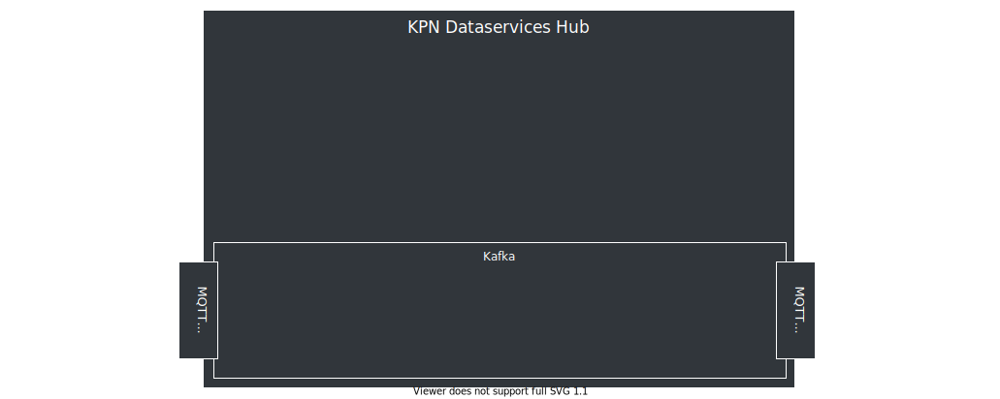
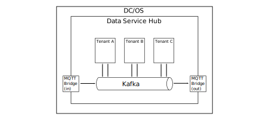

<!-- .slide: data-background="./images/kpn-intro-bg-md.jpg" -->
# An introduction to the Data Services Hub

<!--s-->
# What is the DSH?
AWESOME <!-- .element: class="fragment" data-fragment-index="1" -->


<!--v-->
# Why is the DSH awesome?
<!-- .slide: class="nobullets" -->
- Data platform <!-- .element: class="fragment" data-fragment-index="1" -->
- Data (as events) <!-- .element: class="fragment" data-fragment-index="2" -->
- Sharing <!-- .element: class="fragment" data-fragment-index="3" -->
- Processing <!-- .element: class="fragment" data-fragment-index="4" -->
- Scalable <!-- .element: class="fragment" data-fragment-index="5" -->
- Secure <!-- .element: class="fragment" data-fragment-index="6" -->
- Low-latency <!-- .element: class="fragment" data-fragment-index="7" -->

Note: incomplete list, obvs'.

<!--v-->

# Definition: Streaming Data Platform 

A platform that does something with <!-- .element: class="fragment" data-fragment-index="1" --> _streaming data_ <!-- .element: class="fragment" data-fragment-index="1" -->

<!--v-->

# Definition: platform 
- A (software) platform is anything you can build (applications) on
- Provides reusable infrastructure
- Takes care of recurring and tedious tasks
- Should not hamper creativity

<!--s-->

# Definition: Streaming Data
> &hellip;data that is generated continuously by thousands of data
> sources, which typically send in the data records simultaneously, and in
> small sizes (order of Kilobytes). 

https://aws.amazon.com/streaming-data

Note: this is a quote, and as such only applies to the view of the person making the quote

<!--v-->

## A better definition: Streaming Data

> A streaming data platform should also be able to continuously send selected
> data records to thousands of data sinks.

&ndash;according to us

<!--v-->
# Types of streaming data

Not all datastreams are created equal
 <!-- .element: class="thinner fragment" data-fragment-index="1" -->
 <!-- .element: class="thinner fragment" data-fragment-index="1" -->

<!-- .center: -->
One source, low volume | many sources, high volume  <!-- .element: class="fragment" data-fragment-index="2" -->

Single sensor | Stream processing  <!-- .element: class="fragment" data-fragment-index="3" -->

MQTT | Kafka  <!-- .element: class="fragment" data-fragment-index="4" -->

<!--v-->
## MQTT
- Messaging protocol
- ISO/IEC 20922 and, OASIS standard
- Lightweight messaging protocol
- Suitable for many simultaneous connections
- Widespread in the *Internet of Things*

<!--v-->

## MQTT vs HTTP
 <!-- .element: class="plain" data-fragment-index="1" -->

Note: MQTT is tiny, efficient, and has nearly no overhead. As a result, less loss of messages, can run on smaller devices, and lower power usage (click, show picture)
<!--v-->

## Kafka

- Can handle huge volume of data
- Event-based
- Fast!
- Simple
- Messaging backbone for:  <!-- .element: class="fragment" data-fragment-index="1" -->
    - LinkedIn
    - Netflix
    - Yahoo
    - Twitter
    - Goldman Sachs

<!--v-->
## MQTT vs Kafka

- MQTT
  - _usually_ low volume _(default 10 msgs/sec)_
  - can have many sources/sinks (millions)
  - sources/sinks can reside outside of DSH
- Kafka
  - can have high volume (millions of msgs/sec)
  - _must_ have few sources/sinks
  - sources/sinks reside inside DSH

$$ \text{MQTT} \cdot \frac{sources}{sinks} \approx \text{Kafka} \cdot \frac{sources}{sinks} $$ <!-- .element: class="fragment" data-fragment-index="1" -->

Note: kafka sources/ sinks can also reside outside of DSH

<!--s-->
<!-- .slide: data-transition="fade" -->
## Overview

<!-- .element: class="plain" width="200%" -->

<!--v-->
<!-- .slide: data-transition="fade" -->
## Overview

<!-- .element: class="plain" -->

<!--v-->
<!-- .slide: data-transition="fade" -->
## Overview

<!-- .element: class="plain" -->

<!--v-->
<!-- .slide: data-transition="fade" -->
## Overview

<!-- .element: class="plain" -->

<!--s-->
# MQTT bridge
<!-- .element: class="plain" -->

- Protocol adapter
    - MQTT interface with Kafka
- Like MQTT: allows wildcard subscriptions:<!-- .element: class="fragment" data-fragment-index="1" -->

 ```/platform/stream/topic/#```<!-- .element: class="fragment" data-fragment-index="1" -->

Note: wildcard subscriptions follow

<!--v-->

<!-- .element: class="plain" -->

Example topic structure

<!--v-->

<!-- .element: class="plain" -->

```bash
mosquitto_sub -t "#"
```
<!--v-->

<!-- .element: class="plain" -->

```bash
mosquitto_sub -t "house/Study/Tele/SENSOR/#"
```

<!--v-->

<!-- .element: class="plain" -->
```bash
mosquitto_sub -t "house/Study/Tele/#"
```
<!--v-->

<!-- .element: class="plain" -->

```bash
mosquitto_sub -t "house/+/Tele/SENSOR/#"
```

<!--v-->


[](https://asciinema.org/a/242386)
<!-- <script id="asciicast-WXXC4cMVi73TxVpLS8aB02Ucr" src="https://asciinema.org/a/WXXC4cMVi73TxVpLS8aB02Ucr.js" async></script> -->

<!--v-->
## Bridge

$$\begin{align}
\text{MQTT topic prefix} &= \text{Kafka cluster name} \\\\\\  
\text{MQTT topic infix}  &= \text{Kafka topic name} \\\\\\
\text{keys in Kafka}     &= \text{MQTT topic suffix} \\\\\\ 
\end{align}$$

```scala
MQTT(topic="/tt/cam/id", data="...")
```
<!-- .element: class="fragment" data-fragment-index="2" -->
$=$
<!-- .element: class="fragment" data-fragment-index="2" -->
```scala
Kafka(cluster="tt", topic="stream.cam.*", key="id", data="...")
```
<!-- .element: class="fragment" data-fragment-index="2" -->

Note: clearly explain that MQTT has a tree-like topic-structure, while Kafka puts everything under a single stream; the structure is kept, but ACLs are no longer applied.

<!--v-->
## Rarely updated data sources

- Latest value store indexing service
- tracks keys in a stream
- distributed in-memory key-value store

<!--v-->
## External data sources 

- are not always MQTT
- do not always stream
- will require custom adapters
    - allow tenants to write their own

<!--s-->
<!-- .slide: data-transition="fade" -->
## Overview

<!-- .element: class="plain" -->

<!--v-->
<!-- .slide: data-transition="fade" -->
## Overview

<!-- .element: class="plain" -->

<!--s-->
# Wrap-up

- MQTT for low volume, many sources/sinks
- Kafka for high volume, few sources/sinks
- bridge (protocol adaptor) to tie them together 
- custom data source adapters for external data 
- latest value store for instant syncing with rarely changing data source

<!--s-->
# Stream Processing Platform
A platform that does  <!-- .element: class="fragment" data-fragment-index="1" --> _stream processing_  <!-- .element: class="fragment" data-fragment-index="1" -->

<!--v-->
## Stream Processing

> &hellip; is the processing of data in motion, or in other words,
> computing on data directly as it is produced or received.

https://data-artisans.com/what-is-stream-processing

Note: key point; process the data while in motion.

<!--v-->
## Where to process

- At the edge where possible and necessary
- Close to the data (on the DSH) if you need a lot of data from multiple sources

Note: emphasize necessaty of data&mdash;ECG sensors. 

<!--v-->
## Many ways to process the data

- Many frameworks for stream processing
- No framework fits all use-cases
- DSH does not dictate a framework

No _One framework to rule them all_, but the DSH to _bind them_.

Note: analogy: you can bring your project to Black&Decker, and then you'll have a workshop with Black&Decker tools. We provide an empty toolshed; you want to use a Gamma drill? You use a Gamma drill. Alternatively: if you have a BMW, you'll to bring it to a garage that is familiar with BMW. However, we provide an empty shed, you bring your own tools. We don't care if you're going to come in with a BMW, Audi, or a horse.

<!--s-->
# Wrap-up

- DSH can process streams: 
    - but is not always the right place to do it
    - and does not dictate how to process them

<!--s-->
# Security nightmare

- Need to allow other people on your platform for proximity
- And they can use whatever software they want on the platform

<!--v-->
## DC/OS

- Started with DC/OS as base platform 
- Supported by most stream processing frameworks
- Tenants run docker containers on top

<!--v-->
## Securing

- Custom container manager to force correct use of Docker
- Custom resource manager to control resource requests
- Calico for network isolation

<!--v-->
<!-- .slide: data-transition="fade" -->
## DC/OS

<!-- .element: class="plain" -->

<!--v-->
<!-- .slide: data-transition="fade" -->
## DC/OS

<!-- .element: class="plain" -->
<!--s-->

# Wrap-up

- DC/OS as base
- Docker + extra security
- Tenant network isolation

Note: question to audience "how do tenants communicate?" KAFKAAAAA

<!--s-->
# Data Stream Platform

a platform that holds many different <!-- .element: class="fragment" data-fragment-index="1" -->_data streams_<!-- .element: class="fragment" data-fragment-index="1" -->

<!--v-->
## Data Stream

> A sequence of digitally encoded signals used to represent information in transmission.

[Federal Standard 1037C](https://www.its.bldrdoc.gov/fs-1037/fs-1037c.htm)

<!--v-->
## Many data streams

- Streams need organizing
- DSH topics $ \approx $ Kafka topics
- Need to control access to topics
	- Manage at topic level using custom tooling
    - Based on Access Control Lists (ACLs)

<!--v-->
## Authenticate

- Certificates for tenant (container) authentication towards Kafka
- API key to authenticate tenants that want to let devices/things/users connect to the platform
- REST token for authentication of MQTT token requests
- Tokens for MQTT authentication of devices/things/users

<!--v-->
<!-- .slide: data-transition="fade" -->
## Authentication relations

<!-- .element: class="plain" -->

<!--v-->
<!-- .slide: data-transition="fade" -->
## Authentication relations

<!-- .element: class="plain" -->

<!--v-->
<!-- .slide: data-transition="fade" -->
## Authentication relations

<!-- .element: class="plain" -->

Note: emphasize why the REST token is required -> multiple protocols in future

<!--v-->
<!-- .slide: data-transition="fade" -->
## Authentication relations

<!-- .element: class="plain" -->

<!--v-->
## Device management

- Provides the necessary building blocks
- DSH does not manage devices
- Up to the tenant to implement

Note: improve!

<!--v-->
## Access control

- Fine-grained on MQTT
  - read `/tt/topic/fixed/tenant/+/#`
  - write `/tt/topic/other/tenant/`
- Coarse-grained on Kafka
  - read/write on topic-level

<!--v-->
## Kafka
Three Kafka stream-types
-  _stream._ topic
-  _internal._ topic 
-  _scratch._ topic

<!--s-->
# Wrap-up

- API keys, REST token & MQTT tokens 
- Kafka certificates
- ACLs on all streams/topics
- Kafka topics scheme

<!--s-->
<!-- .slide: data-background="./images/kpn-end-bg-md.jpg" -->
