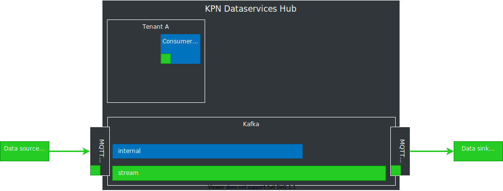

<!-- .initialize({
	width: "100%",
	height: "100%",
	margin: 0,
	minScale: 0.2,
	maxScale: 3
});-->

<!-- .slide: data-background="./images/kpn-intro-bg-md.jpg" -->
# An introduction to the Data Services Hub

<!--s-->
# What is the DSH?
AWESOME <!-- .element: class="fragment" data-fragment-index="1" -->


<!--v-->
# Why is the DSH awesome?
What is it?
What does it do better than others?
What are the key aspects?
<!-- .slide: class="nobullets" -->
- Data platform <!-- .element: class="fragment" data-fragment-index="1" -->
- Data (as events) <!-- .element: class="fragment" data-fragment-index="2" -->
- Sharing <!-- .element: class="fragment" data-fragment-index="3" -->
- Processing <!-- .element: class="fragment" data-fragment-index="4" -->
- Scalable <!-- .element: class="fragment" data-fragment-index="5" -->
- Secure <!-- .element: class="fragment" data-fragment-index="6" -->
- Low-latency <!-- .element: class="fragment" data-fragment-index="7" -->

Note: incomplete list, obvs'.

<!--v-->

# What is the DSH?

A platform that does something awesome with <!-- .element: class="fragment" data-fragment-index="1" --> _streaming data_ <!-- .element: class="fragment" data-fragment-index="1" -->

<!--v-->

# Definition: platform 
- A (software) platform is anything you can build (applications) on
- Provides reusable infrastructure
- Takes care of recurring and tedious tasks
- Should not hamper creativity

<!--s-->

# Definition: Streaming Data
> &hellip;data that is generated continuously by thousands of data
> sources, which typically send in the data records simultaneously, and in
> small sizes (order of Kilobytes). 

https://aws.amazon.com/streaming-data

Note: this is a quote, and as such only applies to the view of the person making the quote

<!--v-->

## Our definition: Streaming Data

> A streaming data platform should also be able to continuously send selected
> data records to thousands of data sinks.

<!--v-->
# Data Streams

The DSH holds many different <!-- .element: class="fragment" data-fragment-index="1" -->_data streams_<!-- .element: class="fragment" data-fragment-index="1" -->

<!--v-->
## Data Stream

> A sequence of digitally encoded signals used to represent information in transmission.

[Federal Standard 1037C](https://www.its.bldrdoc.gov/fs-1037/fs-1037c.htm)

<!--v-->
# Types of streaming data

Not all datastreams are created equal

 <!-- .element: class="thinner fragment" data-fragment-index="1" -->
 <!-- .element: class="thinner fragment" data-fragment-index="1" -->


$$
\begin{align}
\text{One source, low volume} &| \text{many sources, high volume} \\\\\\  
\text{Single sensor} &| \text{Stream processing} \\\\\\  
\text{MQTT} &| \text{Kafka} \\\\\\  
\end{align}
$$ <!-- .element: class="thinner fragment" data-fragment-index="2" -->

<!--s-->
## MQTT
- Messaging protocol
- ISO/IEC 20922 and, OASIS standard
- Lightweight messaging protocol
- Suitable for many simultaneous connections
- Widespread in the *Internet of Things*

Note: more about MQTT later

<!--v-->

## Kafka

- Can handle huge volume of data
- Event-based
- Fast!
- Messaging backbone for:  <!-- .element: class="fragment" data-fragment-index="1" -->
    - LinkedIn
    - Netflix
    - Twitter
    <!-- - Goldman Sachs -->

<!--v-->
## MQTT vs Kafka

- MQTT
  - _usually_ low volume _(default 10 msgs/sec)_
  - can have many sources/sinks (millions)
  - sources/sinks can reside outside of DSH
- Kafka
  - can have high volume (millions of msgs/sec)
  - _must_ have few sources/sinks
  - sources/sinks reside inside DSH

$$ \text{MQTT} \cdot \frac{sources}{sinks} \approx \text{Kafka} \cdot \frac{sources}{sinks} $$ <!-- .element: class="fragment" data-fragment-index="1" -->

Note: kafka sources/ sinks can also reside outside of DSH

<!--s-->
<!-- .slide: data-transition="fade" -->
## Overview

<!-- .element: class="stretch" style="background:none; border:none; box-shadow:none;" width="100%" -->

<!--v-->
<!-- .slide: data-transition="fade" -->
## Overview

<!-- .element: class="stretch" style="background:none; border:none; box-shadow:none;" width="100%" -->

<!--v-->
<!-- .slide: data-transition="fade" -->
## Overview

<!-- .element: class="stretch" style="background:none; border:none; box-shadow:none;" width="100%" -->

<!--v-->
<!-- .slide: data-transition="fade" -->
## Overview

<!-- .element: class="stretch" style="background:none; border:none; box-shadow:none;" width="100%" -->
<!--v-->
<!-- .slide: data-transition="fade" -->
## Overview

<!-- .element: class="stretch" style="background:none; border:none; box-shadow:none;" width="100%" -->

<!--s-->
# MQTT
<!-- .element: class="stretch" style="background:none; border:none; box-shadow:none;" width="100%" -->

<!--v-->
## MQTT bridge
<!-- .element: class="stretch" style="background:none; border:none; box-shadow:none;" width="30%" -->
- Protocol adapter
    - MQTT interface with Kafka
- Like MQTT: allows wildcard subscriptions:<!-- .element: class="fragment" data-fragment-index="2" -->

 ```
 /platform/stream/topic/#
 ```
 <!-- .element: class="fragment" data-fragment-index="2" -->

Note: wildcard subscriptions later, in the MQTT part

<!--v-->
## External data sources 

- are not always MQTT ... <!-- .element: class="fragment" data-fragment-index="2" -->
<!-- - do not always stream -->
- ... and will therefore require custom adapters  <!-- .element: class="fragment" data-fragment-index="3" -->

We allow tenants to write their own adapters  <!-- .element: class="fragment" data-fragment-index="4" -->

Note: do we say other adapters are in the works?

<!--s-->
<!-- .slide: data-transition="fade" -->

# Kafka

<!-- .element: class="stretch" style="background:none; border:none; box-shadow:none;" width="100%" -->

<!--v-->

## Kafka
Three Kafka stream-types
-  _stream._ topic
-  _internal._ topic 
-  _scratch._ topic

<!--v-->
<!-- .slide: data-transition="fade" -->
<!-- .element: class="stretch" style="background:none; border:none; box-shadow:none;" width="100%" -->


<!--v-->
## Many data streams

- Streams need organizing
- DSH topics $ \approx $ Kafka topics
- Need to control access to topics
	<!-- - Manage at topic level using custom tooling
    - Based on Access Control Lists (ACLs) -->

Note: control access to topics will be dealt with later
<!--s-->
# Stream Processing
The DSH is a platform that does  <!-- .element: class="fragment" data-fragment-index="1" --> _stream processing_  <!-- .element: class="fragment" data-fragment-index="1" -->

<!--v-->
## Stream Processing

> &hellip; is the processing of data in motion, or in other words,
> computing on data directly as it is produced or received.

https://data-artisans.com/what-is-stream-processing

Note: key point; process the data while in motion.

<!--v-->
## Where to process
<!-- .element: class="plain" -->

- At the source?
- On the DSH?
- At the sink?

Note: example ECG sensors. First, all data is processed at the computer of the doctor, so all data needs to be transferred and stored. All data is relevant, since all data is needed for processing. Migrating processing to the device allows for less data in need to be transferred: less power usage, less storage required, and faster decision making. Go over the limitations of all these strategies.

<!--v-->
## Many ways to process the data

- Many frameworks for stream processing
- No framework fits all use-cases
- DSH does not dictate a framework

No _One framework to rule them all_, but the DSH to _bind them_.  

Note: analogy: you can bring your project to Black&Decker, and then you'll have a workshop with Black&Decker tools. We provide an empty toolshed; you want to use a Gamma drill? You use a Gamma drill. Alternatively: if you have a BMW, you'll to bring it to a garage that is familiar with BMW. However, we provide an empty shed, you bring your own tools. We don't care if you're going to come in with a BMW, Audi, or a horse.

<!--s-->
# Security nightmare

- Need to allow other people on your platform for proximity
- And they can use whatever software they want on the platform

<!--v-->
<!-- .slide: data-transition="fade" -->
## Base DSH
<!-- .element: class="stretch" style="background:none; border:none; box-shadow:none;" width="100%" -->
<!--v-->
<!-- .slide: data-transition="fade" -->
## Calico
<!-- .element: class="stretch" style="background:none; border:none; box-shadow:none;" width="100%" -->
<!--v-->
<!-- .slide: data-transition="fade" -->
## DC/OS
<!-- .element: class="stretch" style="background:none; border:none; box-shadow:none;" width="100%" -->
<!--v-->
<!-- .element: class="stretch" style="background:none; border:none; box-shadow:none;" width="100%" -->
Note: DC/OS is the base, tenants run their docker containers on top of it. DC/OS is supported by most stream processing frameworks

<!--v-->
## Securing

- Custom container manager 
    - for ease of use
    - to _force_ correct use of Docker
- Custom resource manager
- Calico to ensure network isolation

Note: docker is already quite secure, but the DSH ensures you can't hack your way out of your container (you can't be root)

<!--v-->

# Wrap-up

- DC/OS as base
- Docker + extra security
- Tenant network isolation

Note: question to audience "how do tenants communicate?" KAFKAAAAA

<!--s-->
# Authentication Nightmare

- Certificates for tenant (container) authentication towards Kafka
- API key to authenticate tenants that want to let devices/things/users connect to the platform
- REST token for authentication of MQTT token requests
- Tokens for MQTT authentication of devices/things/users

<!--v-->
<!-- .slide: data-transition="fade" -->
## Authentication relations

<!-- .element: class="stretch" style="background:none; border:none; box-shadow:none;" width="100%" -->
<!--v-->
<!-- .slide: data-transition="fade" -->
## Authentication relations

<!-- .element: class="stretch" style="background:none; border:none; box-shadow:none;" width="100%" -->
<!--v-->
<!-- .slide: data-transition="fade" -->
## Authentication relations

<!-- .element: class="stretch" style="background:none; border:none; box-shadow:none;" width="100%" -->
Note: emphasize why the REST token is required -> multiple protocols in future

<!--v-->
<!-- .slide: data-transition="fade" -->
## Authentication relations

<!-- .element: class="stretch" style="background:none; border:none; box-shadow:none;" width="100%" -->
<!--v-->
## Device management

- DSH does not manage devices
- Up to the tenant to implement <!-- .element: class="fragment" data-fragment-index="2" -->
- Provides the necessary building blocks <!-- .element: class="fragment" data-fragment-index="2" -->

Note: which building blocks?

<!--v-->
## Access control

- Fine-grained on MQTT
  - Access Control Lists (ACLs)
  - read `/tt/topic/fixed/tenant/+/#`
  - write `/tt/topic/other/tenant/`
- Coarse-grained on Kafka
  - read/write on topic-level
  - implemented using custom tooling

<!--s-->
# Wrap-up

- API keys, REST token & MQTT tokens 
- Kafka certificates
- ACLs on all streams/topics
- Kafka topics scheme

<!--s-->
<!-- .slide: data-background="./images/kpn-end-bg-md.jpg" -->
# Practical part; MQTT
[MQTT](localhost:1948/mqtt.md)
Note: tell the audience that the next part is for the technical people. The rest can go get coffee and feel inadequate.