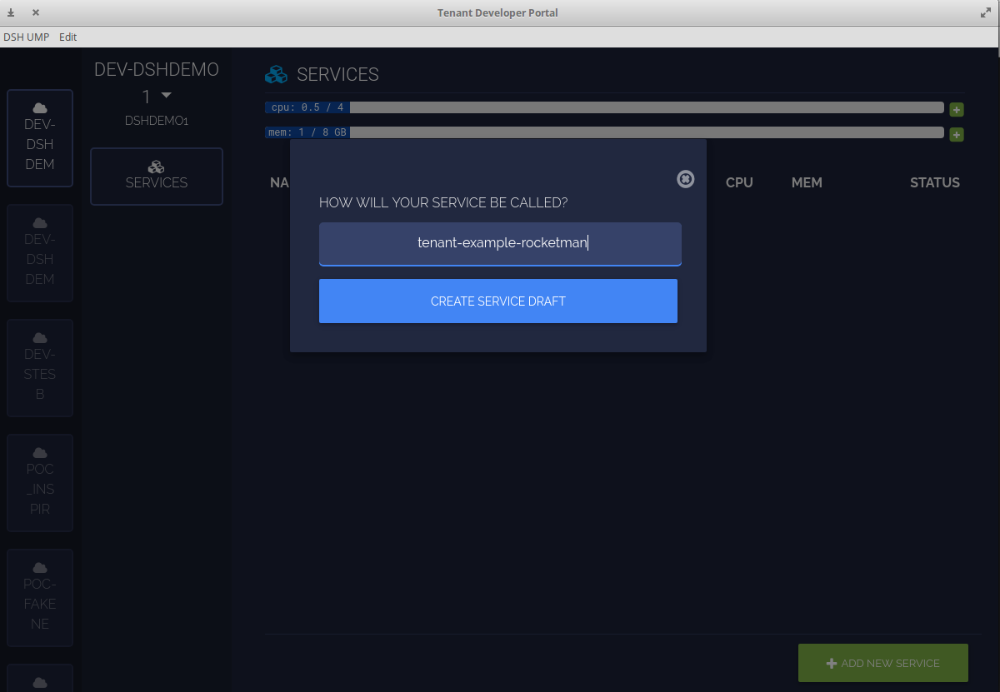
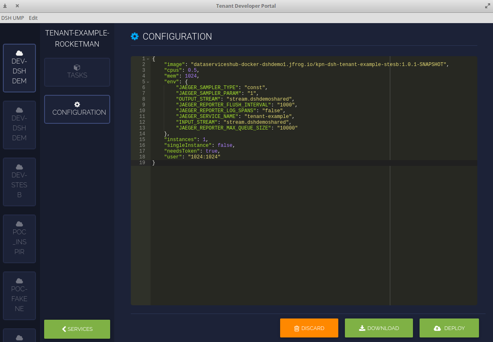

<!-- .slide: data-background="./images/below.jpg" --> 
# Streaming over Kafka

<!--s-->
<!-- .slide: data-background="./images/fish.jpg" --> 
## Prerequisites
- _Installed:_ Curl
- _Installed:_ Mosquitto (MQTT-client)
- _Installed:_ Docker-CE
- _Installed:_ Git
- _Installed:_ java SDK 8
- _Installed:_ maven (mvn) 
- _Installed:_ DSH UMP-client
- _Available:_ tenant UID
- _Available:_ docker registry credentials
- _Available:_ API-Key

<!--s-->
<!-- .slide: data-background="./images/star.jpg" --> 
## Goal 

Learn to deploy an application on DSH that connects to DSH kafka

<!--s-->
<!-- .slide: data-background="./images/star.jpg" --> 
## Steps

1. Get tenant example
2. Build docker container
3. Push docker container to tenant's docker registry
4. Use UMP to deploy container on DSH
5. Use MQTT to contact container

<!--s-->
<!-- .slide: data-background="./images/jelly.jpg" --> 
## Get tenant example
- Clone this repo from git: https://github.com/kpn-dsh/tenant-example
- It contains a fully working tenant example
  - in java
  - built with maven
  - builds docker image

<!--s-->
<!-- .slide: data-background="./images/jelly.jpg" --> 
## Inspect
### Dockerfile => UID

- Change your pwd (present working directory) to `tenant-example`
- Open the `Dockerfile` in your favorite text-editor
- Modify the `ENV id 1024` line according to the comment above it and save the
  modification

<!--s-->
<!-- .slide: data-background="./images/jelly.jpg" --> 
## Inspect
## Inspect
### pom.xml => tenant 
- Open the `pom.xml` in your favorite text-editor
- Modify the tenant to your tenant
```xml
<tenant>dshdemo2</tenant>
```
- Modify version to something that contains your name: e.g.
```xml
<version>1.0.1-bruno-SNAPSHOT</version> 
```

<!--s-->
<!-- .slide: data-background="./images/jelly2.jpg" --> 
## Build
```
mvn package
```
This will build the java binary and the docker container _locally_. Look in the
output for the name of the docker image.

<!--s-->
<!-- .slide: data-background="./images/jelly2.jpg" --> 
## Push
Since every tenant has its own docker registry this will be reflected in the
container tag name:
```bash
dataserviceshub-docker-$TENANT.jfrog.io/image:...
```
You need to be logged in to use this registry:
```bash
docker login dataserviceshub-docker-$TENANT.jfrog.io
```
Now you can push your container to the tenant's docker registry:

```bash
docker push \
  dataserviceshub-docker-$TENANT.jfrog.io/tenant-example:...
```

<!--s-->
<!-- .slide: data-background="./images/jelly2.jpg" --> 
## Deploying
The docker container has now been build and safely stored in the docker
registry. Next step is getting that container running on the DSH.
<!--s-->
<!-- .slide: data-background="./images/jelly3.jpg" --> 
## UMP
- is an angular/electron based application 
- connects to DSH over MQTT
- can be used to manage/request resources (CPUs, Memory, VHosts and Volumes)
- can deploy applications to DSH
<!--s-->
<!-- .slide: data-background="./images/jelly3.jpg" --> 
## Download
- Linux:<br>https://s3.eu-central-1.amazonaws.com/dsh-ump/auto-update/dsh-ump-1.2.0-x86_64.AppImage
- OSX:<br>https://s3.eu-central-1.amazonaws.com/dsh-ump/auto-update/DSH-UMP-1.2.0.dmg
- Windows:<br>https://s3.eu-central-1.amazonaws.com/dsh-ump/auto-update/DSH-UMP+Setup+1.2.0.exe

<!--s-->
<!-- .slide: data-background="./images/jelly3.jpg" --> 
## Connect/Setup UMP

- Click `+` to add a new environment
- Fill in the requested values

<!--s-->
<!-- .slide: data-background="./images/jelly4.jpg" --> 
## Deploy application
- Click on the _Add new service_ button 
- and name it `tenant-example-<your_name>`
<!--s-->
<!-- .slide: data-background="./images/jelly4.jpg" --> 

<!--s-->
<!-- .slide: data-background="./images/jelly4.jpg" --> 
## Deploy application
- create AMP definition (see `tenant-example.json`)
- modify the name of the image
- modify the user if needed
- and click _deploy_
<!--s-->
<!-- .slide: data-background="./images/jelly4.jpg" --> 

<!--s-->
<!-- .slide: data-background="./images/jelly4.jpg" --> 
## Test application
The kpn-tenant-example listens to the `dshdemoshared` topics on the `command` key.
Two commands are supported:
- whoami
- restart

Responses to those commands are written on the `response` key.
<!--s-->
<!-- .slide: data-background="./images/jelly5.jpg" --> 
# Verify
You can set up an mqtt connection to verify:
```bash
mosquitto_sub -h mqtt.$PLATFORM.kpn-dsh.com -p 8883 \
-t "/tt/dshdemoshared/response/#" \
--capath /etc/ssl/certs/ -d -P "`cat mqtt-token.txt`" \
-u $THING_ID -v
```
On macosx use
```bash
mosquitto_sub -h mqtt.$PLATFORM.kpn-dsh.com -p 8883 \
-t "/tt/dshdemoshared/response/#"  \
--cafile /usr/local/etc/openssl/cert.pem -d \ 
-P "`cat mqtt-token.txt`" -u $THING_ID -v
```

<!--s-->
<!-- .slide: data-background="./images/jelly5.jpg" --> 
## Verify
```bash
mosquitto_pub -h mqtt.$PLATFORM.kpn-dsh.com -p 8883 \
-t "/tt/dshdemoshared/command/" \
--capath /etc/ssl/certs/ -d -P "`cat mqtt-token.txt`" \
-u $THING_ID -l
```
On macosx use

```bash
mosquitto_pub -h mqtt.$PLATFORM.kpn-dsh.com -p 8883 \
-t "/tt/dshdemoshared/command/" \
--cafile /usr/local/etc/openssl/cert.pem -d \
-P "`cat mqtt-token.txt`" -u $THING_ID -l
```

Type:
```
whoami 
```
and see what's returned in the subscription.
<!--s-->
<!-- .slide: data-background="./images/below.jpg" --> 
End of this tutorial.
