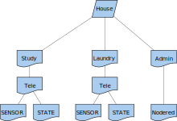
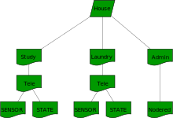
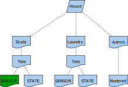
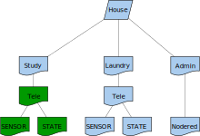
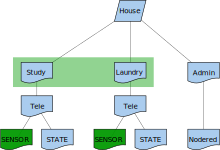

<!-- .slide: data-background="./images/kpn-intro-bg-md.jpg" -->
## Streaming over MQTT

<!--s-->
## MQTT bridge

<!-- .element: class="stretch" style="background:none; border:none; box-shadow:none;" width="100%" -->

Note: MQTT Protocol adapter allows MQTT interface with Kafka

<!--v-->
<!-- .slide: data-transition="fade" -->
<!-- .element: class="stretch" style="background:none; border:none; box-shadow:none;" width="50%" -->

```bash
mosquitto_sub -t ""
```

<!--v-->
<!-- .slide: data-transition="fade" -->
<!-- .element: class="stretch" style="background:none; border:none; box-shadow:none;" width="50%" -->

```bash
mosquitto_sub -t "#"
```

<!--v-->
<!-- .slide: data-transition="fade" -->
<!-- .element: class="stretch" style="background:none; border:none; box-shadow:none;" width="50%" -->

```bash
mosquitto_sub -t "house/Study/Tele/SENSOR/#"
```

<!--v-->
<!-- .slide: data-transition="fade" -->
<!-- .element: class="stretch" style="background:none; border:none; box-shadow:none;" width="50%" -->

```bash
mosquitto_sub -t "house/Study/Tele/#"
```

<!--v-->
<!-- .slide: data-transition="fade" -->
<!-- .element: class="stretch" style="background:none; border:none; box-shadow:none;" width="50%" -->

```bash
mosquitto_sub -t "house/+/Tele/SENSOR/#"
```

<!--v-->
[](https://asciinema.org/a/242386)

Note: MQTT has a tree-like topic-structure, while Kafka puts everything under a single stream; the tree-like structure is kept, but fine-grained MQTT ACLs are no longer applied.

<!--v-->
### Rarely updated data sources

By default, MQTT does not store anything.

This is a potential issue when working with rarely updated data sources.  <!-- .element: class="fragment"-->

There is a 'retain'-flag  <!-- .element: class="fragment"-->

Note: messages are simply passed through. A sensor update will be thrown to whoever is subscribed. But what about the status of a bridge? Or a message stating a door is open or closed?

<!--s-->
<!-- .slide: data-transition="fade" -->
## Authentication relations

<!-- .element: class="stretch" style="background:none; border:none; box-shadow:none;" width="100%" -->

<!--s-->
## Prerequisites

- Required: [Curl](https://curl.haxx.se)
- Required: [Mosquitto](https://mosquitto.org) (MQTT-client)
- Optional: [jq](https://stedolan.github.io/jq/)
- Alternative: [Virtual Machine](https://github.com/mtjon/dsh-tut-vm) containing the tools
- Available: An API-Key (will be provided)

<!--s-->
## Goal

Learn how to subscribe and publish data on one of the DSH public datastreams
via MQTT

<!--v-->
### Steps

1. Get an API-key
2. Use API-key to request a REST token
3. Use REST token to request an MQTT token
4. Use MQTT token to subscribe to a datastream
5. Use MQTT token to publish on a datastream

<!--s-->
## API-keys on DSH

Are used to _identify_ entities that can manage DSH MQTT access for a group of things.

Each of these entities can use this API-key to:  
<!-- .element: class="lefty fragment" data-fragment-index="1" -->
- onboard<!-- .element: class="fragment" data-fragment-index="1" --> _multiple_ things to DSH MQTT
<!-- .element: class="fragment" data-fragment-index="1" -->
- give things access to a <!-- .element: class="fragment" data-fragment-index="1" --> _limited set_ of streams <!-- .element: class="fragment" data-fragment-index="1" -->
- control on a <!-- .element: class="fragment" data-fragment-index="1" --> _per thing basis_ what streams a thing can access (out-of-scope) <!-- .element: class="fragment" data-fragment-index="1" -->

we call these entities<!-- .element: class="lefty fragment" data-fragment-index="2" --> _tenants_<!-- .element: class="lefty fragment" data-fragment-index="2" -->

<!--v-->
### Get an API-key

Along with the API-key you will also receive: <!-- .element: class="lefty" -->

- the name of a DSH deployment (`PLATFORM`)
- the name of the tenant (`TENANT`)
- other info you do not need for this tutorial

Take a look at the existing variables. <!-- .element: class="lefty" -->

```bash
echo PLATFORM=...
echo TENANT=...
echo API_KEY=...
```

<!--s-->
## REST tokens

- can be requested over the _REST API_ of DSH on the `/auth/v0/token` endpoint
- this endpoint requires an _API-key_ and the name of your _tenant_

<!--v-->
### Getting a REST token

```bash
  curl -X POST \
  "https://api.$PLATFORM.kpn-dsh.com/auth/v0/token" \
  -H "apikey: $API_KEY" \
  -d '{"tenant": "'$TENANT'"}' > rest-token.txt
```

<!--v-->
### The resulting REST token

- This command will result in a _REST token_
- This is a _JWT_ containing a set of _REST claims_
- These claims describe
  - what _other_ REST APIs you can access
  - which _actions_ are allowed on those APIs
- The `datastreams/v0/mqtt/token` claim should be in the token, otherwise it
  will be impossible to request an MQTT token

<!--s-->
### Contents of a REST token (JWT)

Execute<!-- .element: class="lefty" -->

```bash
cat rest-token.txt
```

to see the token and navigate to <!-- .element: class="lefty" -->[jwt.io](https://jwt.io)
and replace the data in the encoded form on the webpage by the contents of the
JWT (REST token) you received in the previous step.<!-- .element: class="lefty" -->

Did you just blindly give away credentials to an unknown website?  <!-- .element: class="lefty fragment" data-fragment-index="1" -->

<!--v-->
### Contents of a JWT (local)

<!-- .element: class="lefty" -->Command-line alternative for Linux:

```bash
cat rest-token.txt | \
sed "s/[^.]*\.\([^.]*\)\.[^.]*/\1===/;s/\(\(....\)*\).*/\1/" | \
base64 -d | \
jq .
```

<!-- .element: class="lefty" -->Command-line alternative for macOS:

```bash
cat rest-token.txt | \
sed "s/[^.]*\.\([^.]*\)\.[^.]*/\1===/;s/\(\(....\)*\).*/\1/" | \
base64 -D | \
jq .
```

<!--s-->
## MQTT tokens

- can be requested over the _REST API_ of DSH
  at `/datastreams/v0/mqtt/token`
- this requires a _REST token_
  with the `datastreams/v0/mqtt/token` claim
- required to request the token for a named thing

```bash
export THING_ID=...
```

<!--v-->
### Getting an MQTT token

```bash
curl -X POST \
"https://api.$PLATFORM.kpn-dsh.com/datastreams/v0/mqtt/token" \
-H "Authorization: Bearer `cat rest-token.txt`" \
-d '{"id":"'$THING_ID'"}' > mqtt-token.txt
```

<!--v-->
### The resulting MQTT token

- This command will result in an _MQTT token_
- This is a _JWT_ containing a set of _claims_
- They describe:
  - what other REST APIs you can access
  - what actions are allowed on those APIs

Note that:

- The mqtt thing id __must be unique__ (within your tenant) since only one
  connection with this id is allowed.
- Not all REST tokens allow all thing ids (some are bound to one specific THING_ID)

<!--s-->
## Contents of an MQTT token

<!-- .element: class="lefty" -->Use [jwt.io](https://jwt.io) or use the command-line alternative for Linux:

```bash
cat mqtt-token.txt | \
sed "s/[^.]*\.\([^.]*\)\.[^.]*/\1===/;s/\(\(....\)*\).*/\1/" | \
base64 -d | \
jq .
```

<!-- .element: class="lefty" -->Use jwt.io or use the command-line alternative for macOS:

```bash
cat mqtt-token.txt | \
sed "s/[^.]*\.\([^.]*\)\.[^.]*/\1===/;s/\(\(....\)*\).*/\1/" | \
base64 -D | \
jq .
```

<!--s-->
## Subscribe

- We will all subscribe to _training_, a stream created specifically for
  this tutorial.
- If you inspect the mqtt token, you will see that the allowed pattern for the
  subscription is `+/#`
  - `+` => a topic level element is allowed here, but no mqtt wildcards
  - `#` => wildcards are allowed here
  - `word` => you need to copy this verbatim

<!--v-->

### Mosquitto_sub

<!-- .element: class="lefty" -->On Linux, execute the following command:

```bash
mosquitto_sub -h mqtt.$PLATFORM.kpn-dsh.com -p 8883 \
-t "/tt/training/$THING_ID/#" --capath /etc/ssl/certs/ \
-d -P "`cat mqtt-token.txt`" -u $THING_ID -v
```

<!-- .element: class="lefty" -->On macOS, use `--cafile iso --capath`:

```bash

mosquitto_sub -h mqtt.$PLATFORM.kpn-dsh.com -p 8883 \
-t "/tt/training/$THING_ID/#" \
--cafile /usr/local/etc/openssl/cert.pem \
-d -P "`cat mqtt-token.txt`" -u $THING_ID -v
```

<!--v-->
### Notes

- The username (`-u ...`) is not required for the DSH; it gets overruled
  by the `THING_ID` in the token. We put it here because some versions of the
  mosquitto client expect it to be there. 
- `--capath` or `--cafile` is where the mosquitto client can find the SSL root
  certificates on your system, required to be able to connect to our mqtt
  protocol-adapter over SSL

<!--s-->
## Publish

- To see any data on our subscription, we need to publish some first
- Open a new terminal, we are going to use it to periodically send a message to DSH over mqtt
  - Ensure the required environment variables are available

<!--v-->
### Mosquitt_pub

<!-- .element: class="lefty" -->On Linux, execute the following command:

```bash
while sleep 1; do date "+$THING_ID%S"; done | \
mosquitto_pub -h mqtt.$PLATFORM.kpn-dsh.com \
-p 8883 -t "/tt/training/$THING_ID/" \
--capath /etc/ssl/certs/ \
-d -P "`cat mqtt-token.txt`" -u $THING_ID -l
```

<!-- .element: class="lefty" -->On macOS, execute the following command:

```bash
while sleep 1; do date "+$THING_ID%S"; done | \
mosquitto_pub -h mqtt.$PLATFORM.kpn-dsh.com \
-p 8883 -t "/tt/training/$THING_ID/" \
--cafile /usr/local/etc/openssl/cert.pem \
-d -P "`cat mqtt-token.txt`" -u $THING_ID -l
```

<!--v-->
### Result

- What do you see? Why?
- Try replacing `sleep 1` by `true`; what happens?
- To allow the platform to scale, publish rate over MQTT is limited to 10
  msgs/sec.<!-- .element: class="fragment" -->

<!--s-->
<!-- .slide: data-background="./images/kpn-end-bg-md.jpg" -->
## Practical part; deploying microservices

[Deploying Microservices](localhost:1948/deploying.md)
