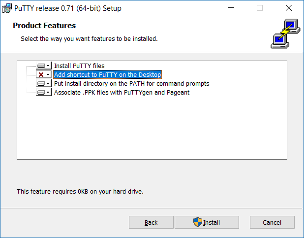
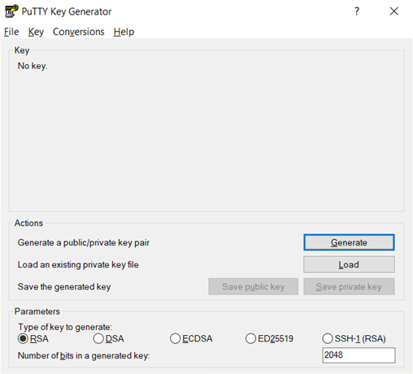

<!-- .slide: data-background="./images/kpn-intro-bg-md.jpg" -->
# SSH guides

<!--s-->
<!-- # Terminology -->
We'll first need to introduce some terminology, definitions, and things you'll interact with.

If you know about SSH, can generate your own ssh-keys, and are familiar with a terminal or shell, you can skip this part.
<!--v-->

# Terminology
- VM: Virtual Machine. The trainer made one for everyone. We will identify these based on their IP.
- SSH: secure shell. A way to interact with remote systems (such as our VM). 
- Authentication: the VM only allows SSH connections from systems it knows. So, you'll need to authenticate. 

Note: for keyfiles, see next slide.

<!--v-->
# Keyfiles
1. You will generate your own unique keyfile.
2. You will send this keyfile to your trainer.
3. Your keyfile will be given to your VM, which will then be able to recognize and authenticate your session.

A keyfile consists of two parts:
- A private key. You do _NOT_ share this, ever.
- A public key, which you can share. This should have the extionsion `.pub`

<!--v-->
# Options to connect over SSH
- Linux and Mac have an SSH client built in.
- Windows _usually_ does not. 
    - PowerShell has a SSH-module (Posh-SSH).
    - Putty is a free SSH (and Telnet) client. There are versions for Linux and Mac as well.
    - Windows Subsystem for Linux allows you to run Linux commands (including SSH) on your Windows system.
    - Many more options, use whatever you're comfortable with. We'll discuss the first three.

<!--s-->
# Do you already have SSH?
1. Open a terminal (or PowerShell; WIN+X, A, click `yes`).
2. type `ssh`, and hit `enter`

If you see a response (i.e. not an error), you have SSH!
Hang back and wait for everyone else to catch up!

<!-- Hang back and let the plebians deal with the horror of installing basic software. -->


<!--s-->
# Getting Putty

1. Download Putty ([64bit](https://the.earth.li/~sgtatham/putty/latest/w64/putty-64bit-0.71-installer.msi), [32bit](https://the.earth.li/~sgtatham/putty/latest/w32/putty-0.71-installer.msi))
2. Open the installer, and follow the instructions. Please ensure the features look like this:
<!-- .element: class="plain" -->

<!--v-->
# SSH keys (PuttyGen)
Open PuttyGen, and look for the 'generate'-button:
<!-- .element: class="plain" -->

<!--v-->

puttygen privatekey.ppk -O private-openssh -o privatekey.pem

<!--s-->

# Getting WSL
1. Open PowerShell (WIN+X, A), and run the following command:
```powershell
Enable-WindowsOptionalFeature -Online -FeatureName Microsoft-Windows-Subsystem-Linux
```
<!-- - This simple command tells Windows to go and collect the Windows Subsystem for Linux, without you needing to go through all the menu's and clickyboxes. -->
2. Reboot when prompted.
3. After rebooting, open the Windows Store, and search for `Ubuntu`.
4. Click `install` or `download`, and wait for it to complete.
5. When it's done, there should be an icon for Ubuntu. Click it, set (and remember!) your password.
7. Go to the next slide (down)

<!--v-->
# SSH key generation
8. In your Ubuntu terminal, type 
```bash
sudo apt install ssh
ssh-keygen -t rsa
```
9. Follow the instructions. 
10. Open the `run` dialog in Windows (WIN+R), and enter
`%LocalAppData%\Packages\`
11. Find the one that has `Ubuntu` in its name 
<!-- (CanonicalGroupLimited.Ubuntu18.04onWindows_79rhkp1fndgsc) -->
12. Drill down to `\LocalState\rootfs\home\`, 
13. Open the folder corresponding to your Ubuntu username, and open the .ssh folder. 
14. Mail the `.pub` file to the trainer.

<!--s-->
# Getting SSH (Powershell) 

Type the following commands in PowerShell (type `y` when asked)
```powershell
Find-Module Posh-SSH
Install-Module Posh-SSH
```
You now have PowerShell installed!

First, type `ssh`, and see if it still generates an error. 
- If the error disappeared, you have SSH! (and you use the default `ssh` command)
- If yes, go to the next slide (down):

<!--v-->
# Using SSH (Powershell) 
Create a new SSH session
```powershell
New-SSHSession -ComputerName "YOUR_IP_HERE" -Credential (Get-Credential)
```
And follow the instructions.

Finally, run commands using 
```powershell
Invoke-SSHCommand -Index 0 -Command "whoami"
```
Note that PowerShell sends one command over SSH at a time. Replace `whoami` with the command you want to run.

<!-- ALT:
Enter-PSSession -HostName UserA@LinuxServer02:22 -KeyFilePath c:\<path>\userAKey_rsa
Enter-PSSession -HostName UserA@LinuxServer01 -->
<!--v-->

# Powershell SSH key generation

Start powershell, and run:
```powershell
mkdir %userprofile%/.ssh
cd %userprofile%/.ssh
ssh-keygen -t rsa -C "your_email@example.com"
```
And follow the instructions, naming the key as follows: `id_yourname`. If this generates an error, attract the attention of the trainer.

Open the run dialog (WIN+R), and type `%userprofile%/.ssh`. You should find two files, of which one  the public (`.pub`) key. Send the public key to the trainer.


<!--s-->
# Connecting
Let's say you've mailed your public keyfile to the trainer, and he sent you the IP of your VM.
- Your `ssh key` is in `.ssh`, and is called `id_iot`.
- The IP you got is 52.59.203.96.
You will then run:
```powershell
ssh -i .ssh/id_iot ubuntu@52.59.203.96
```
Where the -i flag stands for `identity`, and `ubuntu` is the default username.

Note that if you're using PowerShell and it's not cooperating, go to the next slide (down)
<!--v-->
# Using SSH (Powershell) 
Create a new SSH session
```powershell
New-SSHSession -ComputerName "YOUR_IP_HERE" -Credential (Get-Credential)
```
And follow the instructions.

Finally, run commands using 
```powershell
Invoke-SSHCommand -Index 0 -Command "whoami"
```
Note that PowerShell sends one command over SSH at a time. Replace `whoami` with the command you want to run.

<!-- ALT:
Enter-PSSession -HostName UserA@LinuxServer02:22 -KeyFilePath c:\<path>\userAKey_rsa
Enter-PSSession -HostName UserA@LinuxServer01 -->

<!--s-->
# UMP

[Linux](https://s3.eu-central-1.amazonaws.com/dsh-ump/auto-update/dsh-ump-1.2.0-x86_64.AppImage)

[Mac](https://s3.eu-central-1.amazonaws.com/dsh-ump/auto-update/DSH-UMP-1.2.0.dmg)

[Windows](https://s3.eu-central-1.amazonaws.com/dsh-ump/auto-update/DSH-UMP+Setup+1.2.0.exe)